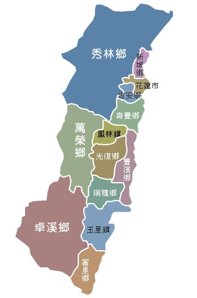
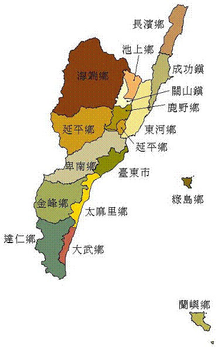

# 跨年旅遊





### 目前挑選的七間
- 台東鹿野 爵士小管
    - http://www.vinyljazz.idv.tw/huan_ying.html
    - 地址：台東縣鹿野鄉龍田村龍六路150號（ 飛行傘降落場旁 ）。
    - 房價 : 爵士小管的**房間均為雙人房**；加大型雙人床四間與標準型雙人床兩間;  每房每晚收費定價新台幣 **6000元整**。
    - 附近景點 龍田村、鹿野高台、鹿野鸞山部落、初鹿牧場
    - 飲食 : **[鹿野市區] 2.8km , 7分鐘車程 ; [台東市區 21km, 30分鐘車程**
- 台東市郊 貓山
    - http://www.mao-shan.idv.tw/
    - 地址：台東縣台東市馬亨亨大道900巷63號
    - 包棟  定價：**20000元  假日：15000元  平日：12000元 ; 客房：四人套房2間、雙人套房1間**
    - 附近景點 : 琵琶湖、小野柳、國際地標、十股綠色隧道、台東森林公園、富岡港口、國立台灣史前文化博物館、卑南文化公園、台東鯉魚山公園、天后宮、龍鳳佛堂、忠烈祠
    - 飲食: **[台東市區]　3.9km, 10分鐘**
- 台東長濱 余水之歡
    - http://www.yujoy.tw/
    - 地址：台東縣長濱鄉三間村真柄47-28號
    - 房價：**雙人房 3200 ; 四人房 4500**
    - 飲食: **[臺東縣長濱鄉公所] 11分鐘, 5.3km 看起來很偏僻沒什麼東西可以吃**
- 花蓮壽豐 雲山水
    - http://www.villa18.com.tw/
    - 地址：蓮縣壽豐鄉豐坪路二段二巷201弄18號
    - 房價 : **雙人房 4500 ~ 5800 ; 四人房 6800 ~ 8300**
    - 推薦景點：太魯閣一日遊、合歡山二日遊、花蓮市郊半日遊、慕谷慕魚生態之旅半日遊、花東縱谷一日遊、東海岸一日遊、南橫公路采風經花東縱谷
+東海岸二日遊、花東縱谷+東海岸二日遊
(花蓮+台東)、向上秀姑巒溪泛舟一日遊、多羅滿賞鯨生態之旅
    - 飲食: **[壽豐鄉公所] 9.1km , 13分鐘車程, 看起來也是很偏僻沒什麼東西可以吃**
- 花蓮豐濱 石梯平
    - http://www.theadagio.com.tw/
    - 地址 ： 花蓮縣豐濱鄉石梯灣123號
    - 房價 ： **雙人房 4500 ~ 5500 ; 四人房 6500起**
    - 附近景點 : 那ㄜ哩岸木雕工作坊、月洞 神秘的月亮洞穴、石梯漁港、石梯坪休憩區 台灣第一的壺穴景觀、項鍊海岸工作室 迎向海洋的創作地、奚卜蘭島、海角工作室 漂流木藝術、鐵花村、 優雅的孤島、升火工作室與瀰漫咖啡、拙而奇藝術工作室、
    - 飲食:** [豐濱鄉公所] 14.3km , 17分鐘車程, 看起來也是很偏僻沒什麼東西可以吃**
- 新竹橫山 登美山莊
    - http://www.follower.com.tw/
    - 地址 ： 新竹縣橫山鄉南昌村4鄰24-1號
    - 房價 ： **雙人房 3200 ~ 3800 ; 四人房 5300 ~ 6300**
    - 附近景點：清泉溫泉、峨眉湖、張學良故居、十七公里海岸
    - 飲食:** [內灣老街] 15.2km , 33分鐘車程**
- 花蓮新港  新港77
    - http://www.hk77.com.tw/
    - 地址 ：花蓮市新港街77號
    - 房價 ： **雙人 2400 ; 四人 3800**
    - 飲食 :** [花蓮火車站] 1.8km , 7分鐘車程**


- 十大民宿排名

```
第一名「台東─余水知歡」、
第二名「屏東─白砂15」、
第三名「花蓮─緩慢石梯坪」、
第四名「澎湖─藍海天晴」、
第五名「嘉義─四季星空」、
第六名「台南─謝宅」、
第七名「花蓮─雲山水」、
第八名「宜蘭─大漁日和」、
第九名「台中─私房雨露」、
第十名「屏東─海境」。
```
