# 租車
### 台東捷陞
```
http://www.089-230311.com.tw/
服務項目
◇ 汽機車出租
◇ 機車託運
◇ 中古車出售
◇ 室內寄車

 ＊ 免費行李寄放 ＊

平日二～五營業時間早上７：００~晚上１２：００
週休六．日．一或連假  營業時間早上６：００~晚上１２：００
電話 : 089-230311
地址 : 台東市新站路152巷7號 (火車站出口右前方第一家)

◎ 以上價格以24小時內為一天計算,逾時另計收費．

◎ 本店所有車輛須原地．原油量還車,租用期間汽油由租車人自理。

須訂到車票確認到達時間才接受訂車,自簡訊傳出後３日內請匯款,無匯款者將取消訂車,需再來電重新訂車
[約定的時間未來取車,半小時後本店有權將車輛另出租他人,訂金恕不退費]！
1. 不分平日週休.訂車即享預約價過年農曆春節為原價。

 104/10/9~10/11為週休價 12/31~105/1/1.1/2.1/3元旦連假為週休假

2. 本店所有車輛皆依法投保～強制險～非車損險,如租賃期間損壞刮傷   皆以修復原狀賠償並加算維修期間天數視同續租。

3. 租車時需持中華民國有效期限正本駕照且本人使用(例：普通小型車以上     之駕照 )。考取駕照後有３年以上經常開車經驗且年齡滿23歲．如來取     車時非訂車人,未帶駕照正本者或不符本店之規定,本店依安全考量可拒絕出租．

4. 如逾時還車時,須按實際超出之時數補足差額每一小時費用為一日租金的     十分之一計算。

★-訂車程序

1. 先訂好車票確定到達時間向本店訂車,不可事後再變更取車時間．

2. 本店以簡訊告知匯款帳號及金額,３日內請完成訂金手續,未能及時匯款又未來電話告知是否匯款,將取消訂車,請重新訂車以免耽誤他人訂車權益,請客戶將匯款的帳號後５碼「非交易序號」或匯款人名字回傳證明．請注意訊息有無登錄錯誤請立即告知改正．．

3. 訂車客人務必詳記取車日期．時間及還車日期．時間,遇取車日與還車日不同時請速告知店家更正,一律以簡訊證明,避免與其他客人撞日.不可事後或現場變更日期時間.

4. 約定的時間未前來取車,半小時後本店有權將車輛另出租他人,訂金恕不退費

5. 逢連假/週休２-3日時,恕不接受晚上取車．須現場看車．

租車契約詳細內容以本店租賃契約為準。

```

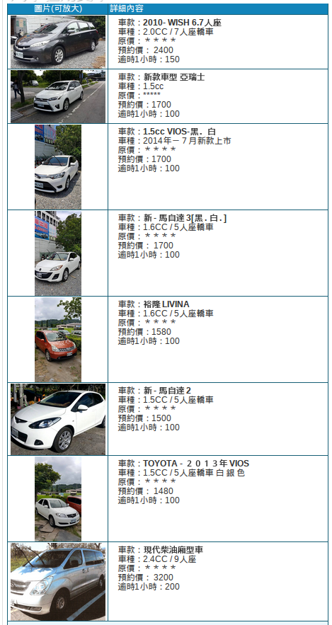
---
### 聯合租車
```
http://www.uncar.net/rent.htm
台東聯合租車位於台東火車站前100公尺，給您便捷的租車服務。
我們的服務有汽車租賃、司機代駕、旅遊諮詢、民宿介紹，滿足您的用車需求。
　　◎以上價位為單日租金，以廿四小時計算，超時另外計費。
　　◎本公司提供台東車站及台東機場免費接送服務；並提供知本地區、台東市區
　　　、富岡碼頭...等交車服務【需加收服務費】。
　　◎聯合貼心服務，關山取車、還車限用預約價．
　　◎取車地點：台東車站店、台東機場、關山車站、知本地區。
　　◎還車地點：台東車站店、台東機場、關山車站、知本地區、花蓮車站、花蓮機場。
　　◎台東租花蓮還須加收手續費、台東地區【甲租乙還】限用預約價計費。
　　◎持台新信用卡、國民旅遊卡預約本公司各式車輛享訂價7折優惠【限台東車站機場租還】。
　　◎如預訂車遇不可抗拒因素時，本公司得以其他同等級車輛代替或退回訂金。

　『租車須知』
以上費率均以24小時租用之日租金計算。 營業時間：08:00至20:00，請於營業時間內完成租、還車手續。
本租車費率內含強制險。
承租人須年滿20歲及持有有效駕駛執照。
承租人請攜帶身分證及駕照 。
(承租人需符合上述資格，若發生不實情況，承租人需自行負責，本公司不予退費)
本車輛使用之燃油由承租人自備，還車時油量若少於交車時油量，應負責補足。
若發現車輛有瑕疵或操作不良時，請立即告知本公司，若行駛超過40公里或1小時之後，仍須負擔日租金。
農曆春節期及連續假期間不適用以上優惠專案。
車輛若發生任何意外事故、失竊或其他肇事事件時，請立即通知警察機關，並立即撥打(089)233-988告知本公司服務人員協助處理。

訂金匯款方式：
　 ＊訂金金額：車資費用之30%。
　 ＊春節期間之訂金請全額匯款,謝謝。
　 ＊取消預約訂車於取車日7天前通知,扣訂金30%~3天前通知扣訂金50%
　　 3天前通知扣訂金70%當天通知及當天未通知者 則視同放棄訂車權利,並不得退還訂金
```

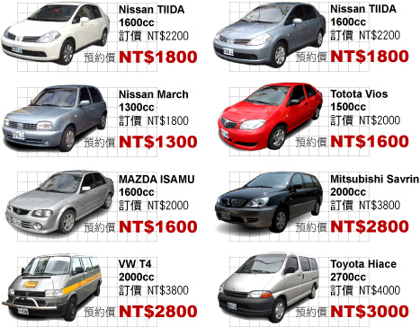

---

### 東帝

```
http://www.tungdi.com.tw/car.htm

租車須知
	承租人須攜帶台灣汽車駕駛執照及身分證。102年7月之前過期之駕照請換新，謝謝。
	平日租金為一日之租金，不分淡季或旺季，農曆春節期間價格為定價。租金包含汽車強制險。
	租賃汽車滿八小時以一日計。日租逾時每小時以一日租金的十分之ㄧ計，可彈性收費。
	洽公.團體.長期租賃另有優惠，歡迎來電洽詢。
	提供本店分店(台東市區.台東車站.台東機場)還車免收費用。另有飯店、富岡港口交車服務，須事先預約。
	本店為國民旅遊卡特約店，可使用信用卡消費。若為優惠價請以現金交易。機車不提供刷卡服務。
	提供旅遊地圖、旅遊諮詢


匯款帳號

彰化銀行台東分行 009	戶名	帳號
東帝小客車租賃行	8508-01-24738-200
```

<table border="1" width="100%">
				<tbody><tr>
					<td rowspan="4" align="center"><b><font color="#0000FF" face="標楷體" size="6"><u>
			<a href="#日產" style="text-decoration: none">日產</a></u></font></b></td>
					<td align="center">
		<b>
		<font face="Arial Unicode MS" size="5">MARCH</font></b><font face="Arial Unicode MS" size="4">1300cc</font><p>
					<font size="5" face="標楷體">定價</font><font face="Arial Unicode MS" size="5">1800</font></p>
					<b>
					<font face="標楷體" size="6">平日租金</font><font size="6" face="Arial Unicode MS">1200</font></b></td>
					<td>
		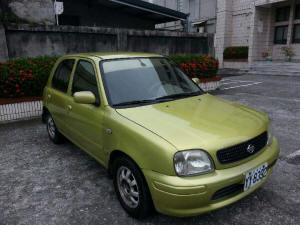</td>
				</tr>
				<tr>
					<td align="center">
		<b>
		<font face="Arial Unicode MS" size="5">NEW MARCH</font></b><font face="Arial Unicode MS" size="4">1500CC</font><p>
					<font size="5" face="標楷體">定價</font><font face="Arial Unicode MS" size="5">2500</font></p>
					<b>
					<font face="標楷體" size="6">平日租金</font><font size="6" face="Arial Unicode MS">1800</font></b></td>
					<td>
					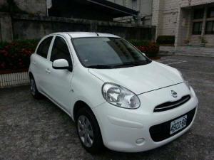</td>
				</tr>
				<tr>
					<td align="center">
		<b>
		<font face="Arial Unicode MS" size="5">TIIDA</font></b><font face="Arial Unicode MS" size="4">1600CC</font><p>
					<font size="5" face="標楷體">定價</font><font face="Arial Unicode MS" size="5">2500</font></p>
					<b>
					<font face="標楷體" size="6">平日租金</font><font size="6" face="Arial Unicode MS">1800</font></b></td>
					<td>
					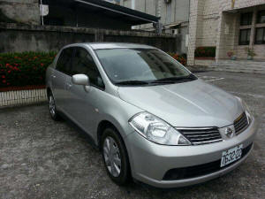</td>
				</tr>
				<tr>
					<td align="center">
		<b><font face="Arial Unicode MS" size="5">LIVINA</font></b><font face="Arial Unicode MS" size="4">1600CC</font><p>
					<font size="5" face="標楷體">定價</font><font face="Arial Unicode MS" size="5">2500</font></p>
					<b>
					<font face="標楷體" size="6">平日租金</font><font size="6" face="Arial Unicode MS">1800</font></b></td>
					<td>
					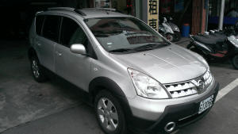</td>
				</tr>
				<tr>
					<td rowspan="6" align="center"><b><font face="標楷體" size="6"> <u>
			<a href="#豐田" style="text-decoration: none">豐田</a></u></font></b></td>
					<td align="center">
		<b>
		<font face="Arial Unicode MS" size="5">VIOS</font></b><font face="Arial Unicode MS" size="4">1500CC</font><p>
					<font size="5" face="標楷體">定價</font><font face="Arial Unicode MS" size="5">2200</font></p>
					<b>
					<font face="標楷體" size="6">平日租金</font><font size="6" face="Arial Unicode MS">1500</font></b></td>
					<td>
					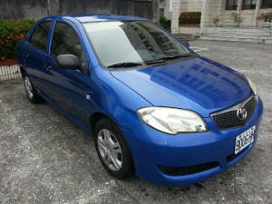</td>
				</tr>
				<tr>
					<td align="center">
		<b>
		<font face="Arial Unicode MS" size="5">NEW VIOS</font></b><font face="Arial Unicode MS" size="4">1500CC</font><p>
					<font size="5" face="標楷體">定價</font><font face="Arial Unicode MS" size="5">2500</font></p>
					<b>
					<font face="標楷體" size="6">平日租金</font><font size="6" face="Arial Unicode MS">1800</font></b></td>
					<td>
					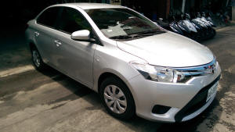</td>
				</tr>
				<tr>
					<td align="center">
		<b>
		<font face="Arial Unicode MS" size="5">YARIS</font></b><font face="Arial Unicode MS" size="4">1500CC</font><p>
					<font size="5" face="標楷體">定價</font><font face="Arial Unicode MS" size="5">2500</font></p>
					<b>
					<font face="標楷體" size="6">平日租金</font><font size="6" face="Arial Unicode MS">1800</font></b></td>
					<td>
					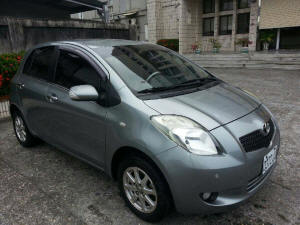</td>
				</tr>
				<tr>
					<td align="center">
		<b>
		<font face="Arial Unicode MS" size="5">NEW YARIS</font></b><font face="Arial Unicode MS" size="4">1500CC</font><p>
					<font size="5" face="標楷體">定價</font><font face="Arial Unicode MS" size="5">2700</font></p>
					<b>
					<font face="標楷體" size="6">平日租金</font><font face="Arial Unicode MS" size="6">2000</font></b><p>　</p></td>
					<td>
					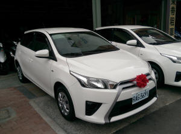</td>
				</tr>
				<tr>
					<td align="center"><b>
					<font face="Arial Unicode MS" size="5">ALTIS</font></b><font face="Arial Unicode MS" size="4">1800CC</font><p>
					<font size="5" face="標楷體">定價</font><font face="Arial Unicode MS" size="5">2900</font></p>
					<b>
					<font face="標楷體" size="6">平日租金</font><font size="6" face="Arial Unicode MS">2200</font></b></td>
					<td>
					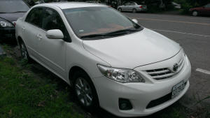</td>
				</tr>
				<tr>
					<td align="center">
		<b>
		<font face="Arial Unicode MS" size="5">CAMRY</font></b><font face="Arial Unicode MS" size="4">2000CC</font><p>
					<font size="5" face="標楷體">定價</font><font face="Arial Unicode MS" size="5">3200</font></p>
					<b>
					<font face="標楷體" size="6">平日租金</font><font size="6" face="Arial Unicode MS">2500</font></b></td>
					<td>
					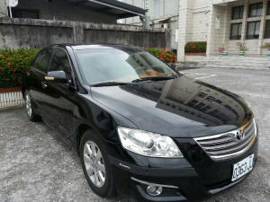</td>
				</tr>
				<tr>
					<td align="center"><b><font face="標楷體" size="6">
			<u><a href="#福特" style="text-decoration: none">福特</a></u></font></b></td>
					<td align="center">
		<b><font face="Arial Unicode MS" size="5">
		FIESTA</font></b><font face="Arial Unicode MS" size="4">1600CC</font><p>
					<font size="5" face="標楷體">定價</font><font face="Arial Unicode MS" size="5">2700</font></p>
					<b>
					<font face="標楷體" size="6">平日租金</font><font size="6" face="Arial Unicode MS">2000</font></b></td>
					<td>
					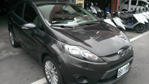</td>
				</tr>
				<tr>
					<td rowspan="2" align="center"><b><u>
		<font face="標楷體" size="6" color="#0000FF">
					<a href="#鈴木" style="text-decoration: none">鈴木</a></font></u></b></td>
					<td align="center">
		<b>
		<font face="Arial Unicode MS" size="5">SOLIO</font></b><font face="Arial Unicode MS" size="4">1300CC</font><p>
					<font size="5" face="標楷體">定價</font><font face="Arial Unicode MS" size="5">2000</font></p>
					<b>
					<font face="標楷體" size="6">平日租金</font><font size="6" face="Arial Unicode MS">1300</font></b></td>
					<td>
					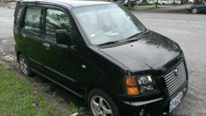</td>
				</tr>
				<tr>
					<td height="22" align="center">
		<b>
		<font face="Arial Unicode MS" size="5">SWIFT</font></b><font face="Arial Unicode MS" size="4">1500CC</font><p>
					<font size="5" face="標楷體">定價</font><font face="Arial Unicode MS" size="5">2500</font></p>
					<b>
					<font face="標楷體" size="6">平日租金</font><font size="6" face="Arial Unicode MS">1800</font></b></td>
					<td height="22">
					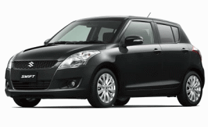</td>
				</tr>
				<tr>
					<td align="center"><font face="標楷體" size="6">
					<b><u>
					<a href="#中華三菱" style="text-decoration: none">三菱</a></u></b></font></td>
					<td align="center">
		<b>
		<font face="Arial Unicode MS" size="5">CLOT PLUS</font></b><font face="Arial Unicode MS" size="4">1600CC</font><p>
					<font size="5" face="標楷體">定價</font><font face="Arial Unicode MS" size="5">2500</font></p>
					<b>
					<font face="標楷體" size="6">平日租金</font><font size="6" face="Arial Unicode MS">1800</font></b></td>
					<td>
					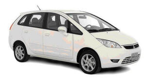</td>
				</tr>
			</tbody></table>


---

### 格上租車

```
https://www.car-plus.com.tw/ugC_CarPrice.asp

地址：	95058台東縣台東市新站路243號
電話：	089-227-979
營業時間：	8:30 ~ 20:30
簡介：	台東火車站旁

```
 <table width="100%" border="0" cellpadding="0" cellspacing="0">
      <tbody>
        <tr>
          <td class="css_CarPriceTitleCenterBg2" style="font-size: 10pt; color: rgb(0, 0, 0); font-family: Verdana; text-decoration: none; word-break: break-all; background-image: url(https://www.car-plus.com.tw/Images/Car/CarPrice_Bg_Center.gif); background-position: 0% 0%; background-repeat: repeat-x;"
            valign="top" width="20%" align="center"></td>
          <td class="css_CarPriceTitleCenterBg" style="font-size: 10pt; color: rgb(0, 0, 0); font-family: Verdana; text-decoration: none; word-break: break-all; border-left-width: 1px; border-left-style: solid; border-left-color: rgb(255, 255, 255); background-image: url(https://www.car-plus.com.tw/Images/Car/CarPrice_Bg_Center.gif); background-position: 0% 0%; background-repeat: repeat-x;"
            valign="center" align="center"></td>
          <td class="css_CarPriceTitleCenterBg" style="font-size: 10pt; color: rgb(0, 0, 0); font-family: Verdana; text-decoration: none; word-break: break-all; border-left-width: 1px; border-left-style: solid; border-left-color: rgb(255, 255, 255); background-image: url(https://www.car-plus.com.tw/Images/Car/CarPrice_Bg_Center.gif); background-position: 0% 0%; background-repeat: repeat-x;"
            valign="top" width="15%" align="center"></td>
          <td class="css_CarPriceTitleCenterBg" style="font-size: 10pt; color: rgb(0, 0, 0); font-family: Verdana; text-decoration: none; word-break: break-all; border-left-width: 1px; border-left-style: solid; border-left-color: rgb(255, 255, 255); background-image: url(https://www.car-plus.com.tw/Images/Car/CarPrice_Bg_Center.gif); background-position: 0% 0%; background-repeat: repeat-x;"
            valign="top" width="9%" align="right"></td>
        </tr>
        <tr>
          <td class="css_CarPriceTitleBottomBg" style="font-size: 10pt; color: rgb(0, 0, 0); font-family: Verdana; text-decoration: none; word-break: break-all; background-image: url(https://www.car-plus.com.tw/Images/Car/CarPrice_Bg_Bottom.gif); background-position: 0% 0%; background-repeat: repeat-x;"
            valign="top" align="left"></td>
          <td colspan="3" class="css_CarPriceTitleBottomBg" style="font-size: 10pt; color: rgb(0, 0, 0); font-family: Verdana; text-decoration: none; word-break: break-all; background-image: url(https://www.car-plus.com.tw/Images/Car/CarPrice_Bg_Bottom.gif); background-position: 0% 0%; background-repeat: repeat-x;"><br>
          </td>
          <td class="css_CarPriceTitleBottomBg" style="font-size: 10pt; color: rgb(0, 0, 0); font-family: Verdana; text-decoration: none; word-break: break-all; background-image: url(https://www.car-plus.com.tw/Images/Car/CarPrice_Bg_Bottom.gif); background-position: 0% 0%; background-repeat: repeat-x;"
            valign="top" align="right"></td>
        </tr>
        <tr class="css_CarPriceTROdd" style="background-color: rgb(249, 249, 249);">
          <td class="css_CarPriceTD" colspan="2" style="font-size: 10pt; color: rgb(0, 0, 0); font-family: Verdana; text-decoration: none; word-break: break-all; padding: 6px 5px 3px; border-bottom-width: 1px; border-bottom-style: solid; border-bottom-color: rgb(77, 122, 223); border-left-width: 1px; border-left-style: solid; border-left-color: rgb(77, 122, 223);"
            nowrap="nowrap" valign="middle" align="left">1500cc. I</td>
          <td class="css_CarPriceTD" style="font-size: 10pt; color: rgb(0, 0, 0); font-family: Verdana; text-decoration: none; word-break: break-all; padding: 6px 5px 3px; border-bottom-width: 1px; border-bottom-style: solid; border-bottom-color: rgb(77, 122, 223); border-left-width: 1px; border-left-style: solid; border-left-color: rgb(77, 122, 223);"
            align="left"><a href="https://www.car-plus.com.tw/ugC_CarPrice.asp#"
              onclick="SetCmd('i','2');return false;" style="color: rgb(0, 0, 255); font-family: Verdana; text-decoration: none;">豐
              田 VIOS 1.5</a></td>
          <td class="css_CarPriceTD" style="font-size: 10pt; color: rgb(0, 0, 0); font-family: Verdana; text-decoration: none; word-break: break-all; padding: 6px 5px 3px; border-bottom-width: 1px; border-bottom-style: solid; border-bottom-color: rgb(77, 122, 223); border-left-width: 1px; border-left-style: solid; border-left-color: rgb(77, 122, 223);"
            align="right"><span class="css_CarPriceTxt" style="font-family: Verdana; font-weight: bold;">2,400</span></td>
          <td class="css_CarPriceTDEnd" style="font-size: 10pt; color: rgb(0, 0, 0); font-family: Verdana; text-decoration: none; word-break: break-all; padding: 6px 5px 3px; border-bottom-width: 1px; border-bottom-style: solid; border-bottom-color: rgb(77, 122, 223); border-left-width: 1px; border-left-style: solid; border-left-color: rgb(77, 122, 223); border-right-width: 1px; border-right-style: solid; border-right-color: rgb(77, 122, 223);"
            valign="middle" align="center"><a href="https://www.car-plus.com.tw/ugC_RentalCarSts.asp?hidChargeLevelCode=00151"
              onmouseover="MM_swapImage('Bu_Rent2','','Images/Car/Bu_Rent02_o.gif',1)"
              onmouseout="MM_swapImgRestore()" style="color: rgb(0, 102, 204); font-family: Verdana; text-decoration: none; width: 73px; height: 20px; display: block; background: url(https://www.car-plus.com.tw/Images/Car/Bu_Rent02.gif);"></a></td>
        </tr>
        <tr class="css_CarPriceTREven" style="background-color: rgb(228, 241, 255);">
          <td class="css_CarPriceTD" colspan="2" rowspan="4" style="font-size: 10pt; color: rgb(0, 0, 0); font-family: Verdana; text-decoration: none; word-break: break-all; padding: 6px 5px 3px; border-bottom-width: 1px; border-bottom-style: solid; border-bottom-color: rgb(77, 122, 223); border-left-width: 1px; border-left-style: solid; border-left-color: rgb(77, 122, 223);"
            nowrap="nowrap" valign="middle" align="left">1500cc. II</td>
          <td class="css_CarPriceTD" style="font-size: 10pt; color: rgb(0, 0, 0); font-family: Verdana; text-decoration: none; word-break: break-all; padding: 6px 5px 3px; border-bottom-width: 1px; border-bottom-style: solid; border-bottom-color: rgb(77, 122, 223); border-left-width: 1px; border-left-style: solid; border-left-color: rgb(77, 122, 223);"
            align="left"><a href="https://www.car-plus.com.tw/ugC_CarPrice.asp#"
              onclick="SetCmd('i','67');return false;" style="color: rgb(0, 0, 255); font-family: Verdana; text-decoration: none;">三
              菱 COLT PLUS 1.5</a></td>
          <td class="css_CarPriceTD" rowspan="4" style="font-size: 10pt; color: rgb(0, 0, 0); font-family: Verdana; text-decoration: none; word-break: break-all; padding: 6px 5px 3px; border-bottom-width: 1px; border-bottom-style: solid; border-bottom-color: rgb(77, 122, 223); border-left-width: 1px; border-left-style: solid; border-left-color: rgb(77, 122, 223);"
            align="right"><span class="css_CarPriceTxt" style="font-family: Verdana; font-weight: bold;">2,500</span></td>
          <td class="css_CarPriceTDEnd" rowspan="4" style="font-size: 10pt; color: rgb(0, 0, 0); font-family: Verdana; text-decoration: none; word-break: break-all; padding: 6px 5px 3px; border-bottom-width: 1px; border-bottom-style: solid; border-bottom-color: rgb(77, 122, 223); border-left-width: 1px; border-left-style: solid; border-left-color: rgb(77, 122, 223); border-right-width: 1px; border-right-style: solid; border-right-color: rgb(77, 122, 223);"
            valign="middle" align="center"><a href="https://www.car-plus.com.tw/ugC_RentalCarSts.asp?hidChargeLevelCode=00152"
              onmouseover="MM_swapImage('Bu_Rent67','','Images/Car/Bu_Rent02_o.gif',1)"
              onmouseout="MM_swapImgRestore()" style="color: rgb(0, 102, 204); font-family: Verdana; text-decoration: none; width: 73px; height: 20px; display: block; background: url(https://www.car-plus.com.tw/Images/Car/Bu_Rent02.gif);"></a></td>
        </tr>
        <tr class="css_CarPriceTREven" style="background-color: rgb(228, 241, 255);">
          <td class="css_CarPriceTD" style="font-size: 10pt; color: rgb(0, 0, 0); font-family: Verdana; text-decoration: none; word-break: break-all; padding: 6px 5px 3px; border-bottom-width: 1px; border-bottom-style: solid; border-bottom-color: rgb(77, 122, 223); border-left-width: 1px; border-left-style: solid; border-left-color: rgb(77, 122, 223);"
            align="left"><a href="https://www.car-plus.com.tw/ugC_CarPrice.asp#"
              onclick="SetCmd('i','47');return false;" style="color: rgb(0, 0, 255); font-family: Verdana; text-decoration: none;">日
              產 MARCH 1.5</a></td>
        </tr>
        <tr class="css_CarPriceTREven" style="background-color: rgb(228, 241, 255);">
          <td class="css_CarPriceTD" style="font-size: 10pt; color: rgb(0, 0, 0); font-family: Verdana; text-decoration: none; word-break: break-all; padding: 6px 5px 3px; border-bottom-width: 1px; border-bottom-style: solid; border-bottom-color: rgb(77, 122, 223); border-left-width: 1px; border-left-style: solid; border-left-color: rgb(77, 122, 223);"
            align="left"><a href="https://www.car-plus.com.tw/ugC_CarPrice.asp#"
              onclick="SetCmd('i','3');return false;" style="color: rgb(0, 0, 255); font-family: Verdana; text-decoration: none;">豐
              田 YARIS 1.5</a></td>
        </tr>
        <tr class="css_CarPriceTREven" style="background-color: rgb(228, 241, 255);">
          <td class="css_CarPriceTD" style="font-size: 10pt; color: rgb(0, 0, 0); font-family: Verdana; text-decoration: none; word-break: break-all; padding: 6px 5px 3px; border-bottom-width: 1px; border-bottom-style: solid; border-bottom-color: rgb(77, 122, 223); border-left-width: 1px; border-left-style: solid; border-left-color: rgb(77, 122, 223);"
            align="left"><a href="https://www.car-plus.com.tw/ugC_CarPrice.asp#"
              onclick="SetCmd('i','97');return false;" style="color: rgb(0, 0, 255); font-family: Verdana; text-decoration: none;">豐
              田 NEW VIOS 1.5</a></td>
        </tr>
        <tr class="css_CarPriceTROdd" style="background-color: rgb(249, 249, 249);">
          <td class="css_CarPriceTD" colspan="2" style="font-size: 10pt; color: rgb(0, 0, 0); font-family: Verdana; text-decoration: none; word-break: break-all; padding: 6px 5px 3px; border-bottom-width: 1px; border-bottom-style: solid; border-bottom-color: rgb(77, 122, 223); border-left-width: 1px; border-left-style: solid; border-left-color: rgb(77, 122, 223);"
            nowrap="nowrap" valign="middle" align="left">1500cc. III</td>
          <td class="css_CarPriceTD" style="font-size: 10pt; color: rgb(0, 0, 0); font-family: Verdana; text-decoration: none; word-break: break-all; padding: 6px 5px 3px; border-bottom-width: 1px; border-bottom-style: solid; border-bottom-color: rgb(77, 122, 223); border-left-width: 1px; border-left-style: solid; border-left-color: rgb(77, 122, 223);"
            align="left"><a href="https://www.car-plus.com.tw/ugC_CarPrice.asp#"
              onclick="SetCmd('i','1');return false;" style="color: rgb(0, 0, 255); font-family: Verdana; text-decoration: none;">本
              田 FIT 1.5</a></td>
          <td class="css_CarPriceTD" style="font-size: 10pt; color: rgb(0, 0, 0); font-family: Verdana; text-decoration: none; word-break: break-all; padding: 6px 5px 3px; border-bottom-width: 1px; border-bottom-style: solid; border-bottom-color: rgb(77, 122, 223); border-left-width: 1px; border-left-style: solid; border-left-color: rgb(77, 122, 223);"
            align="right"><span class="css_CarPriceTxt" style="font-family: Verdana; font-weight: bold;">2,600</span></td>
          <td class="css_CarPriceTDEnd" style="font-size: 10pt; color: rgb(0, 0, 0); font-family: Verdana; text-decoration: none; word-break: break-all; padding: 6px 5px 3px; border-bottom-width: 1px; border-bottom-style: solid; border-bottom-color: rgb(77, 122, 223); border-left-width: 1px; border-left-style: solid; border-left-color: rgb(77, 122, 223); border-right-width: 1px; border-right-style: solid; border-right-color: rgb(77, 122, 223);"
            valign="middle" align="center"><a href="https://www.car-plus.com.tw/ugC_RentalCarSts.asp?hidChargeLevelCode=00154"
              onmouseover="MM_swapImage('Bu_Rent1','','Images/Car/Bu_Rent02_o.gif',1)"
              onmouseout="MM_swapImgRestore()" style="color: rgb(0, 102, 204); font-family: Verdana; text-decoration: none; width: 73px; height: 20px; display: block; background: url(https://www.car-plus.com.tw/Images/Car/Bu_Rent02.gif);"></a></td>
        </tr>
        <tr class="css_CarPriceTREven" style="background-color: rgb(228, 241, 255);">
          <td class="css_CarPriceTD" colspan="2" rowspan="3" style="font-size: 10pt; color: rgb(0, 0, 0); font-family: Verdana; text-decoration: none; word-break: break-all; padding: 6px 5px 3px; border-bottom-width: 1px; border-bottom-style: solid; border-bottom-color: rgb(77, 122, 223); border-left-width: 1px; border-left-style: solid; border-left-color: rgb(77, 122, 223);"
            nowrap="nowrap" valign="middle" align="left">1600 cc. I</td>
          <td class="css_CarPriceTD" style="font-size: 10pt; color: rgb(0, 0, 0); font-family: Verdana; text-decoration: none; word-break: break-all; padding: 6px 5px 3px; border-bottom-width: 1px; border-bottom-style: solid; border-bottom-color: rgb(77, 122, 223); border-left-width: 1px; border-left-style: solid; border-left-color: rgb(77, 122, 223);"
            align="left"><a href="https://www.car-plus.com.tw/ugC_CarPrice.asp#"
              onclick="SetCmd('i','4');return false;" style="color: rgb(0, 0, 255); font-family: Verdana; text-decoration: none;">三
              菱 COLT PLUS 1.6</a></td>
          <td class="css_CarPriceTD" rowspan="3" style="font-size: 10pt; color: rgb(0, 0, 0); font-family: Verdana; text-decoration: none; word-break: break-all; padding: 6px 5px 3px; border-bottom-width: 1px; border-bottom-style: solid; border-bottom-color: rgb(77, 122, 223); border-left-width: 1px; border-left-style: solid; border-left-color: rgb(77, 122, 223);"
            align="right"><span class="css_CarPriceTxt" style="font-family: Verdana; font-weight: bold;">2,600</span></td>
          <td class="css_CarPriceTDEnd" rowspan="3" style="font-size: 10pt; color: rgb(0, 0, 0); font-family: Verdana; text-decoration: none; word-break: break-all; padding: 6px 5px 3px; border-bottom-width: 1px; border-bottom-style: solid; border-bottom-color: rgb(77, 122, 223); border-left-width: 1px; border-left-style: solid; border-left-color: rgb(77, 122, 223); border-right-width: 1px; border-right-style: solid; border-right-color: rgb(77, 122, 223);"
            valign="middle" align="center"><a href="https://www.car-plus.com.tw/ugC_RentalCarSts.asp?hidChargeLevelCode=00160"
              onmouseover="MM_swapImage('Bu_Rent4','','Images/Car/Bu_Rent02_o.gif',1)"
              onmouseout="MM_swapImgRestore()" style="color: rgb(0, 102, 204); font-family: Verdana; text-decoration: none; width: 73px; height: 20px; display: block; background: url(https://www.car-plus.com.tw/Images/Car/Bu_Rent02.gif);"></a></td>
        </tr>
        <tr class="css_CarPriceTREven" style="background-color: rgb(228, 241, 255);">
          <td class="css_CarPriceTD" style="font-size: 10pt; color: rgb(0, 0, 0); font-family: Verdana; text-decoration: none; word-break: break-all; padding: 6px 5px 3px; border-bottom-width: 1px; border-bottom-style: solid; border-bottom-color: rgb(77, 122, 223); border-left-width: 1px; border-left-style: solid; border-left-color: rgb(77, 122, 223);"
            align="left"><a href="https://www.car-plus.com.tw/ugC_CarPrice.asp#"
              onclick="SetCmd('i','5');return false;" style="color: rgb(0, 0, 255); font-family: Verdana; text-decoration: none;">日
              產 TIIDA 1.6</a></td>
        </tr>
        <tr class="css_CarPriceTREven" style="background-color: rgb(228, 241, 255);">
          <td class="css_CarPriceTD" style="font-size: 10pt; color: rgb(0, 0, 0); font-family: Verdana; text-decoration: none; word-break: break-all; padding: 6px 5px 3px; border-bottom-width: 1px; border-bottom-style: solid; border-bottom-color: rgb(77, 122, 223); border-left-width: 1px; border-left-style: solid; border-left-color: rgb(77, 122, 223);"
            align="left"><a href="https://www.car-plus.com.tw/ugC_CarPrice.asp#"
              onclick="SetCmd('i','6');return false;" style="color: rgb(0, 0, 255); font-family: Verdana; text-decoration: none;">日
              產 LIVINA 1.6</a></td>
        </tr>
        <tr class="css_CarPriceTROdd" style="background-color: rgb(249, 249, 249);">
          <td class="css_CarPriceTD" colspan="2" rowspan="2" style="font-size: 10pt; color: rgb(0, 0, 0); font-family: Verdana; text-decoration: none; word-break: break-all; padding: 6px 5px 3px; border-bottom-width: 1px; border-bottom-style: solid; border-bottom-color: rgb(77, 122, 223); border-left-width: 1px; border-left-style: solid; border-left-color: rgb(77, 122, 223);"
            nowrap="nowrap" valign="middle" align="left">1600cc. II</td>
          <td class="css_CarPriceTD" style="font-size: 10pt; color: rgb(0, 0, 0); font-family: Verdana; text-decoration: none; word-break: break-all; padding: 6px 5px 3px; border-bottom-width: 1px; border-bottom-style: solid; border-bottom-color: rgb(77, 122, 223); border-left-width: 1px; border-left-style: solid; border-left-color: rgb(77, 122, 223);"
            align="left"><a href="https://www.car-plus.com.tw/ugC_CarPrice.asp#"
              onclick="SetCmd('i','100');return false;" style="color: rgb(0, 0, 255); font-family: Verdana; text-decoration: none;">日
              產 NEW LIVINA 1.6</a></td>
          <td class="css_CarPriceTD" rowspan="2" style="font-size: 10pt; color: rgb(0, 0, 0); font-family: Verdana; text-decoration: none; word-break: break-all; padding: 6px 5px 3px; border-bottom-width: 1px; border-bottom-style: solid; border-bottom-color: rgb(77, 122, 223); border-left-width: 1px; border-left-style: solid; border-left-color: rgb(77, 122, 223);"
            align="right"><span class="css_CarPriceTxt" style="font-family: Verdana; font-weight: bold;">2,800</span></td>
          <td class="css_CarPriceTDEnd" rowspan="2" style="font-size: 10pt; color: rgb(0, 0, 0); font-family: Verdana; text-decoration: none; word-break: break-all; padding: 6px 5px 3px; border-bottom-width: 1px; border-bottom-style: solid; border-bottom-color: rgb(77, 122, 223); border-left-width: 1px; border-left-style: solid; border-left-color: rgb(77, 122, 223); border-right-width: 1px; border-right-style: solid; border-right-color: rgb(77, 122, 223);"
            valign="middle" align="center"><a href="https://www.car-plus.com.tw/ugC_RentalCarSts.asp?hidChargeLevelCode=00162"
              onmouseover="MM_swapImage('Bu_Rent100','','Images/Car/Bu_Rent02_o.gif',1)"
              onmouseout="MM_swapImgRestore()" style="color: rgb(0, 102, 204); font-family: Verdana; text-decoration: none; width: 73px; height: 20px; display: block; background: url(https://www.car-plus.com.tw/Images/Car/Bu_Rent02.gif);"></a></td>
        </tr>
        <tr class="css_CarPriceTROdd" style="background-color: rgb(249, 249, 249);">
          <td class="css_CarPriceTD" style="font-size: 10pt; color: rgb(0, 0, 0); font-family: Verdana; text-decoration: none; word-break: break-all; padding: 6px 5px 3px; border-bottom-width: 1px; border-bottom-style: solid; border-bottom-color: rgb(77, 122, 223); border-left-width: 1px; border-left-style: solid; border-left-color: rgb(77, 122, 223);"
            align="left"><a href="https://www.car-plus.com.tw/ugC_CarPrice.asp#"
              onclick="SetCmd('i','101');return false;" style="color: rgb(0, 0, 255); font-family: Verdana; text-decoration: none;">福
              特 FOCUS 1.6</a></td>
        </tr>
        <tr class="css_CarPriceTREven" style="background-color: rgb(228, 241, 255);">
          <td class="css_CarPriceTD" colspan="2" rowspan="2" style="font-size: 10pt; color: rgb(0, 0, 0); font-family: Verdana; text-decoration: none; word-break: break-all; padding: 6px 5px 3px; border-bottom-width: 1px; border-bottom-style: solid; border-bottom-color: rgb(77, 122, 223); border-left-width: 1px; border-left-style: solid; border-left-color: rgb(77, 122, 223);"
            nowrap="nowrap" valign="middle" align="left">1600cc. III</td>
          <td class="css_CarPriceTD" style="font-size: 10pt; color: rgb(0, 0, 0); font-family: Verdana; text-decoration: none; word-break: break-all; padding: 6px 5px 3px; border-bottom-width: 1px; border-bottom-style: solid; border-bottom-color: rgb(77, 122, 223); border-left-width: 1px; border-left-style: solid; border-left-color: rgb(77, 122, 223);"
            align="left"><a href="https://www.car-plus.com.tw/ugC_CarPrice.asp#"
              onclick="SetCmd('i','62');return false;" style="color: rgb(0, 0, 255); font-family: Verdana; text-decoration: none;">日
              產 BIG TIIDA 1.6</a></td>
          <td class="css_CarPriceTD" rowspan="2" style="font-size: 10pt; color: rgb(0, 0, 0); font-family: Verdana; text-decoration: none; word-break: break-all; padding: 6px 5px 3px; border-bottom-width: 1px; border-bottom-style: solid; border-bottom-color: rgb(77, 122, 223); border-left-width: 1px; border-left-style: solid; border-left-color: rgb(77, 122, 223);"
            align="right"><span class="css_CarPriceTxt" style="font-family: Verdana; font-weight: bold;">2,900</span></td>
          <td class="css_CarPriceTDEnd" rowspan="2" style="font-size: 10pt; color: rgb(0, 0, 0); font-family: Verdana; text-decoration: none; word-break: break-all; padding: 6px 5px 3px; border-bottom-width: 1px; border-bottom-style: solid; border-bottom-color: rgb(77, 122, 223); border-left-width: 1px; border-left-style: solid; border-left-color: rgb(77, 122, 223); border-right-width: 1px; border-right-style: solid; border-right-color: rgb(77, 122, 223);"
            valign="middle" align="center"><a href="https://www.car-plus.com.tw/ugC_RentalCarSts.asp?hidChargeLevelCode=00163"
              onmouseover="MM_swapImage('Bu_Rent62','','Images/Car/Bu_Rent02_o.gif',1)"
              onmouseout="MM_swapImgRestore()" style="color: rgb(0, 102, 204); font-family: Verdana; text-decoration: none; width: 73px; height: 20px; display: block; background: url(https://www.car-plus.com.tw/Images/Car/Bu_Rent02.gif);"></a></td>
        </tr>
        <tr class="css_CarPriceTREven" style="background-color: rgb(228, 241, 255);">
          <td class="css_CarPriceTD" style="font-size: 10pt; color: rgb(0, 0, 0); font-family: Verdana; text-decoration: none; word-break: break-all; padding: 6px 5px 3px; border-bottom-width: 1px; border-bottom-style: solid; border-bottom-color: rgb(77, 122, 223); border-left-width: 1px; border-left-style: solid; border-left-color: rgb(77, 122, 223);"
            align="left"><a href="https://www.car-plus.com.tw/ugC_CarPrice.asp#"
              onclick="SetCmd('i','98');return false;" style="color: rgb(0, 0, 255); font-family: Verdana; text-decoration: none;">福
              斯 POLO1.6(進口)</a></td>
        </tr>
        <tr class="css_CarPriceTROdd" style="background-color: rgb(249, 249, 249);">
          <td class="css_CarPriceTD" colspan="2" rowspan="3" style="font-size: 10pt; color: rgb(0, 0, 0); font-family: Verdana; text-decoration: none; word-break: break-all; padding: 6px 5px 3px; border-bottom-width: 1px; border-bottom-style: solid; border-bottom-color: rgb(77, 122, 223); border-left-width: 1px; border-left-style: solid; border-left-color: rgb(77, 122, 223);"
            nowrap="nowrap" valign="middle" align="left">1800cc. I</td>
          <td class="css_CarPriceTD" style="font-size: 10pt; color: rgb(0, 0, 0); font-family: Verdana; text-decoration: none; word-break: break-all; padding: 6px 5px 3px; border-bottom-width: 1px; border-bottom-style: solid; border-bottom-color: rgb(77, 122, 223); border-left-width: 1px; border-left-style: solid; border-left-color: rgb(77, 122, 223);"
            align="left"><a href="https://www.car-plus.com.tw/ugC_CarPrice.asp#"
              onclick="SetCmd('i','7');return false;" style="color: rgb(0, 0, 255); font-family: Verdana; text-decoration: none;">三
              菱 LANCER FORTIS 1.8</a></td>
          <td class="css_CarPriceTD" rowspan="3" style="font-size: 10pt; color: rgb(0, 0, 0); font-family: Verdana; text-decoration: none; word-break: break-all; padding: 6px 5px 3px; border-bottom-width: 1px; border-bottom-style: solid; border-bottom-color: rgb(77, 122, 223); border-left-width: 1px; border-left-style: solid; border-left-color: rgb(77, 122, 223);"
            align="right"><span class="css_CarPriceTxt" style="font-family: Verdana; font-weight: bold;">2,900</span></td>
          <td class="css_CarPriceTDEnd" rowspan="3" style="font-size: 10pt; color: rgb(0, 0, 0); font-family: Verdana; text-decoration: none; word-break: break-all; padding: 6px 5px 3px; border-bottom-width: 1px; border-bottom-style: solid; border-bottom-color: rgb(77, 122, 223); border-left-width: 1px; border-left-style: solid; border-left-color: rgb(77, 122, 223); border-right-width: 1px; border-right-style: solid; border-right-color: rgb(77, 122, 223);"
            valign="middle" align="center"><a href="https://www.car-plus.com.tw/ugC_RentalCarSts.asp?hidChargeLevelCode=00180"
              onmouseover="MM_swapImage('Bu_Rent7','','Images/Car/Bu_Rent02_o.gif',1)"
              onmouseout="MM_swapImgRestore()" style="color: rgb(0, 102, 204); font-family: Verdana; text-decoration: none; width: 73px; height: 20px; display: block; background: url(https://www.car-plus.com.tw/Images/Car/Bu_Rent02.gif);"></a></td>
        </tr>
        <tr class="css_CarPriceTROdd" style="background-color: rgb(249, 249, 249);">
          <td class="css_CarPriceTD" style="font-size: 10pt; color: rgb(0, 0, 0); font-family: Verdana; text-decoration: none; word-break: break-all; padding: 6px 5px 3px; border-bottom-width: 1px; border-bottom-style: solid; border-bottom-color: rgb(77, 122, 223); border-left-width: 1px; border-left-style: solid; border-left-color: rgb(77, 122, 223);"
            align="left"><a href="https://www.car-plus.com.tw/ugC_CarPrice.asp#"
              onclick="SetCmd('i','69');return false;" style="color: rgb(0, 0, 255); font-family: Verdana; text-decoration: none;">日
              產 SUPER SENTRA 1.8</a></td>
        </tr>
        <tr class="css_CarPriceTROdd" style="background-color: rgb(249, 249, 249);">
          <td class="css_CarPriceTD" style="font-size: 10pt; color: rgb(0, 0, 0); font-family: Verdana; text-decoration: none; word-break: break-all; padding: 6px 5px 3px; border-bottom-width: 1px; border-bottom-style: solid; border-bottom-color: rgb(77, 122, 223); border-left-width: 1px; border-left-style: solid; border-left-color: rgb(77, 122, 223);"
            align="left"><a href="https://www.car-plus.com.tw/ugC_CarPrice.asp#"
              onclick="SetCmd('i','61');return false;" style="color: rgb(0, 0, 255); font-family: Verdana; text-decoration: none;">納
              智捷 LUXGEN5 Sedan 1.8</a></td>
        </tr>
        <tr class="css_CarPriceTREven" style="background-color: rgb(228, 241, 255);">
          <td class="css_CarPriceTD" colspan="2" rowspan="2" style="font-size: 10pt; color: rgb(0, 0, 0); font-family: Verdana; text-decoration: none; word-break: break-all; padding: 6px 5px 3px; border-bottom-width: 1px; border-bottom-style: solid; border-bottom-color: rgb(77, 122, 223); border-left-width: 1px; border-left-style: solid; border-left-color: rgb(77, 122, 223);"
            nowrap="nowrap" valign="middle" align="left">1800cc. II</td>
          <td class="css_CarPriceTD" style="font-size: 10pt; color: rgb(0, 0, 0); font-family: Verdana; text-decoration: none; word-break: break-all; padding: 6px 5px 3px; border-bottom-width: 1px; border-bottom-style: solid; border-bottom-color: rgb(77, 122, 223); border-left-width: 1px; border-left-style: solid; border-left-color: rgb(77, 122, 223);"
            align="left"><a href="https://www.car-plus.com.tw/ugC_CarPrice.asp#"
              onclick="SetCmd('i','99');return false;" style="color: rgb(0, 0, 255); font-family: Verdana; text-decoration: none;">三
              菱 Lancer io 1.8</a></td>
          <td class="css_CarPriceTD" rowspan="2" style="font-size: 10pt; color: rgb(0, 0, 0); font-family: Verdana; text-decoration: none; word-break: break-all; padding: 6px 5px 3px; border-bottom-width: 1px; border-bottom-style: solid; border-bottom-color: rgb(77, 122, 223); border-left-width: 1px; border-left-style: solid; border-left-color: rgb(77, 122, 223);"
            align="right"><span class="css_CarPriceTxt" style="font-family: Verdana; font-weight: bold;">3,000</span></td>
          <td class="css_CarPriceTDEnd" rowspan="2" style="font-size: 10pt; color: rgb(0, 0, 0); font-family: Verdana; text-decoration: none; word-break: break-all; padding: 6px 5px 3px; border-bottom-width: 1px; border-bottom-style: solid; border-bottom-color: rgb(77, 122, 223); border-left-width: 1px; border-left-style: solid; border-left-color: rgb(77, 122, 223); border-right-width: 1px; border-right-style: solid; border-right-color: rgb(77, 122, 223);"
            valign="middle" align="center"><a href="https://www.car-plus.com.tw/ugC_RentalCarSts.asp?hidChargeLevelCode=00182"
              onmouseover="MM_swapImage('Bu_Rent99','','Images/Car/Bu_Rent02_o.gif',1)"
              onmouseout="MM_swapImgRestore()" style="color: rgb(0, 102, 204); font-family: Verdana; text-decoration: none; width: 73px; height: 20px; display: block; background: url(https://www.car-plus.com.tw/Images/Car/Bu_Rent02.gif);"></a></td>
        </tr>
        <tr class="css_CarPriceTREven" style="background-color: rgb(228, 241, 255);">
          <td class="css_CarPriceTD" style="font-size: 10pt; color: rgb(0, 0, 0); font-family: Verdana; text-decoration: none; word-break: break-all; padding: 6px 5px 3px; border-bottom-width: 1px; border-bottom-style: solid; border-bottom-color: rgb(77, 122, 223); border-left-width: 1px; border-left-style: solid; border-left-color: rgb(77, 122, 223);"
            align="left"><a href="https://www.car-plus.com.tw/ugC_CarPrice.asp#"
              onclick="SetCmd('i','9');return false;" style="color: rgb(0, 0, 255); font-family: Verdana; text-decoration: none;">豐
              田 ALTIS 1.8</a></td>
        </tr>
        <tr class="css_CarPriceTROdd" style="background-color: rgb(249, 249, 249);">
          <td class="css_CarPriceTD" colspan="2" style="font-size: 10pt; color: rgb(0, 0, 0); font-family: Verdana; text-decoration: none; word-break: break-all; padding: 6px 5px 3px; border-bottom-width: 1px; border-bottom-style: solid; border-bottom-color: rgb(77, 122, 223); border-left-width: 1px; border-left-style: solid; border-left-color: rgb(77, 122, 223);"
            nowrap="nowrap" valign="middle" align="left">2000cc. I</td>
          <td class="css_CarPriceTD" style="font-size: 10pt; color: rgb(0, 0, 0); font-family: Verdana; text-decoration: none; word-break: break-all; padding: 6px 5px 3px; border-bottom-width: 1px; border-bottom-style: solid; border-bottom-color: rgb(77, 122, 223); border-left-width: 1px; border-left-style: solid; border-left-color: rgb(77, 122, 223);"
            align="left"><a href="https://www.car-plus.com.tw/ugC_CarPrice.asp#"
              onclick="SetCmd('i','10');return false;" style="color: rgb(0, 0, 255); font-family: Verdana; text-decoration: none;">日
              產 TEANA 2.0</a></td>
          <td class="css_CarPriceTD" style="font-size: 10pt; color: rgb(0, 0, 0); font-family: Verdana; text-decoration: none; word-break: break-all; padding: 6px 5px 3px; border-bottom-width: 1px; border-bottom-style: solid; border-bottom-color: rgb(77, 122, 223); border-left-width: 1px; border-left-style: solid; border-left-color: rgb(77, 122, 223);"
            align="right"><span class="css_CarPriceTxt" style="font-family: Verdana; font-weight: bold;">3,500</span></td>
          <td class="css_CarPriceTDEnd" style="font-size: 10pt; color: rgb(0, 0, 0); font-family: Verdana; text-decoration: none; word-break: break-all; padding: 6px 5px 3px; border-bottom-width: 1px; border-bottom-style: solid; border-bottom-color: rgb(77, 122, 223); border-left-width: 1px; border-left-style: solid; border-left-color: rgb(77, 122, 223); border-right-width: 1px; border-right-style: solid; border-right-color: rgb(77, 122, 223);"
            valign="middle" align="center"><a href="https://www.car-plus.com.tw/ugC_RentalCarSts.asp?hidChargeLevelCode=00200"
              onmouseover="MM_swapImage('Bu_Rent10','','Images/Car/Bu_Rent02_o.gif',1)"
              onmouseout="MM_swapImgRestore()" style="color: rgb(0, 102, 204); font-family: Verdana; text-decoration: none; width: 73px; height: 20px; display: block; background: url(https://www.car-plus.com.tw/Images/Car/Bu_Rent02.gif);"></a></td>
        </tr>
        <tr class="css_CarPriceTREven" style="background-color: rgb(228, 241, 255);">
          <td class="css_CarPriceTD" colspan="2" style="font-size: 10pt; color: rgb(0, 0, 0); font-family: Verdana; text-decoration: none; word-break: break-all; padding: 6px 5px 3px; border-bottom-width: 1px; border-bottom-style: solid; border-bottom-color: rgb(77, 122, 223); border-left-width: 1px; border-left-style: solid; border-left-color: rgb(77, 122, 223);"
            nowrap="nowrap" valign="middle" align="left">2000cc. II</td>
          <td class="css_CarPriceTD" style="font-size: 10pt; color: rgb(0, 0, 0); font-family: Verdana; text-decoration: none; word-break: break-all; padding: 6px 5px 3px; border-bottom-width: 1px; border-bottom-style: solid; border-bottom-color: rgb(77, 122, 223); border-left-width: 1px; border-left-style: solid; border-left-color: rgb(77, 122, 223);"
            align="left"><a href="https://www.car-plus.com.tw/ugC_CarPrice.asp#"
              onclick="SetCmd('i','11');return false;" style="color: rgb(0, 0, 255); font-family: Verdana; text-decoration: none;">豐
              田 CAMRY 2.0</a></td>
          <td class="css_CarPriceTD" style="font-size: 10pt; color: rgb(0, 0, 0); font-family: Verdana; text-decoration: none; word-break: break-all; padding: 6px 5px 3px; border-bottom-width: 1px; border-bottom-style: solid; border-bottom-color: rgb(77, 122, 223); border-left-width: 1px; border-left-style: solid; border-left-color: rgb(77, 122, 223);"
            align="right"><span class="css_CarPriceTxt" style="font-family: Verdana; font-weight: bold;">3,600</span></td>
          <td class="css_CarPriceTDEnd" style="font-size: 10pt; color: rgb(0, 0, 0); font-family: Verdana; text-decoration: none; word-break: break-all; padding: 6px 5px 3px; border-bottom-width: 1px; border-bottom-style: solid; border-bottom-color: rgb(77, 122, 223); border-left-width: 1px; border-left-style: solid; border-left-color: rgb(77, 122, 223); border-right-width: 1px; border-right-style: solid; border-right-color: rgb(77, 122, 223);"
            valign="middle" align="center"><a href="https://www.car-plus.com.tw/ugC_RentalCarSts.asp?hidChargeLevelCode=00201"
              onmouseover="MM_swapImage('Bu_Rent11','','Images/Car/Bu_Rent02_o.gif',1)"
              onmouseout="MM_swapImgRestore()" style="color: rgb(0, 102, 204); font-family: Verdana; text-decoration: none; width: 73px; height: 20px; display: block; background: url(https://www.car-plus.com.tw/Images/Car/Bu_Rent02.gif);"></a></td>
        </tr>
        <tr class="css_CarPriceTROdd" style="background-color: rgb(249, 249, 249);">
          <td class="css_CarPriceTD" colspan="2" style="font-size: 10pt; color: rgb(0, 0, 0); font-family: Verdana; text-decoration: none; word-break: break-all; padding: 6px 5px 3px; border-bottom-width: 1px; border-bottom-style: solid; border-bottom-color: rgb(77, 122, 223); border-left-width: 1px; border-left-style: solid; border-left-color: rgb(77, 122, 223);"
            nowrap="nowrap" valign="middle" align="left">休旅車 I(5人座)</td>
          <td class="css_CarPriceTD" style="font-size: 10pt; color: rgb(0, 0, 0); font-family: Verdana; text-decoration: none; word-break: break-all; padding: 6px 5px 3px; border-bottom-width: 1px; border-bottom-style: solid; border-bottom-color: rgb(77, 122, 223); border-left-width: 1px; border-left-style: solid; border-left-color: rgb(77, 122, 223);"
            align="left"><a href="https://www.car-plus.com.tw/ugC_CarPrice.asp#"
              onclick="SetCmd('i','68');return false;" style="color: rgb(0, 0, 255); font-family: Verdana; text-decoration: none;">納
              智捷 LUXGEN U6 1.8</a></td>
          <td class="css_CarPriceTD" style="font-size: 10pt; color: rgb(0, 0, 0); font-family: Verdana; text-decoration: none; word-break: break-all; padding: 6px 5px 3px; border-bottom-width: 1px; border-bottom-style: solid; border-bottom-color: rgb(77, 122, 223); border-left-width: 1px; border-left-style: solid; border-left-color: rgb(77, 122, 223);"
            align="right"><span class="css_CarPriceTxt" style="font-family: Verdana; font-weight: bold;">3,200</span></td>
          <td class="css_CarPriceTDEnd" style="font-size: 10pt; color: rgb(0, 0, 0); font-family: Verdana; text-decoration: none; word-break: break-all; padding: 6px 5px 3px; border-bottom-width: 1px; border-bottom-style: solid; border-bottom-color: rgb(77, 122, 223); border-left-width: 1px; border-left-style: solid; border-left-color: rgb(77, 122, 223); border-right-width: 1px; border-right-style: solid; border-right-color: rgb(77, 122, 223);"
            valign="middle" align="center"><a href="https://www.car-plus.com.tw/ugC_RentalCarSts.asp?hidChargeLevelCode=005J2"
              onmouseover="MM_swapImage('Bu_Rent68','','Images/Car/Bu_Rent02_o.gif',1)"
              onmouseout="MM_swapImgRestore()" style="color: rgb(0, 102, 204); font-family: Verdana; text-decoration: none; width: 73px; height: 20px; display: block; background: url(https://www.car-plus.com.tw/Images/Car/Bu_Rent02.gif);"></a></td>
        </tr>
        <tr class="css_CarPriceTREven" style="background-color: rgb(228, 241, 255);">
          <td class="css_CarPriceTD" colspan="2" rowspan="2" style="font-size: 10pt; color: rgb(0, 0, 0); font-family: Verdana; text-decoration: none; word-break: break-all; padding: 6px 5px 3px; border-bottom-width: 1px; border-bottom-style: solid; border-bottom-color: rgb(77, 122, 223); border-left-width: 1px; border-left-style: solid; border-left-color: rgb(77, 122, 223);"
            nowrap="nowrap" valign="middle" align="left">休旅車 II(5人座)</td>
          <td class="css_CarPriceTD" style="font-size: 10pt; color: rgb(0, 0, 0); font-family: Verdana; text-decoration: none; word-break: break-all; padding: 6px 5px 3px; border-bottom-width: 1px; border-bottom-style: solid; border-bottom-color: rgb(77, 122, 223); border-left-width: 1px; border-left-style: solid; border-left-color: rgb(77, 122, 223);"
            align="left"><a href="https://www.car-plus.com.tw/ugC_CarPrice.asp#"
              onclick="SetCmd('i','13');return false;" style="color: rgb(0, 0, 255); font-family: Verdana; text-decoration: none;">三
              菱 OUTLANDER 2.4</a></td>
          <td class="css_CarPriceTD" rowspan="2" style="font-size: 10pt; color: rgb(0, 0, 0); font-family: Verdana; text-decoration: none; word-break: break-all; padding: 6px 5px 3px; border-bottom-width: 1px; border-bottom-style: solid; border-bottom-color: rgb(77, 122, 223); border-left-width: 1px; border-left-style: solid; border-left-color: rgb(77, 122, 223);"
            align="right"><span class="css_CarPriceTxt" style="font-family: Verdana; font-weight: bold;">4,000</span></td>
          <td class="css_CarPriceTDEnd" rowspan="2" style="font-size: 10pt; color: rgb(0, 0, 0); font-family: Verdana; text-decoration: none; word-break: break-all; padding: 6px 5px 3px; border-bottom-width: 1px; border-bottom-style: solid; border-bottom-color: rgb(77, 122, 223); border-left-width: 1px; border-left-style: solid; border-left-color: rgb(77, 122, 223); border-right-width: 1px; border-right-style: solid; border-right-color: rgb(77, 122, 223);"
            valign="middle" align="center"><a href="https://www.car-plus.com.tw/ugC_RentalCarSts.asp?hidChargeLevelCode=005J1"
              onmouseover="MM_swapImage('Bu_Rent13','','Images/Car/Bu_Rent02_o.gif',1)"
              onmouseout="MM_swapImgRestore()" style="color: rgb(0, 102, 204); font-family: Verdana; text-decoration: none; width: 73px; height: 20px; display: block; background: url(https://www.car-plus.com.tw/Images/Car/Bu_Rent02.gif);"></a></td>
        </tr>
        <tr class="css_CarPriceTREven" style="background-color: rgb(228, 241, 255);">
          <td class="css_CarPriceTD" style="font-size: 10pt; color: rgb(0, 0, 0); font-family: Verdana; text-decoration: none; word-break: break-all; padding: 6px 5px 3px; border-bottom-width: 1px; border-bottom-style: solid; border-bottom-color: rgb(77, 122, 223); border-left-width: 1px; border-left-style: solid; border-left-color: rgb(77, 122, 223);"
            align="left"><a href="https://www.car-plus.com.tw/ugC_CarPrice.asp#"
              onclick="SetCmd('i','107');return false;" style="color: rgb(0, 0, 255); font-family: Verdana; text-decoration: none;">日
              產 X-Trail 2.0</a></td>
        </tr>
        <tr class="css_CarPriceTROdd" style="background-color: rgb(249, 249, 249);">
          <td class="css_CarPriceTD" colspan="2" style="font-size: 10pt; color: rgb(0, 0, 0); font-family: Verdana; text-decoration: none; word-break: break-all; padding: 6px 5px 3px; border-bottom-width: 1px; border-bottom-style: solid; border-bottom-color: rgb(77, 122, 223); border-left-width: 1px; border-left-style: solid; border-left-color: rgb(77, 122, 223);"
            nowrap="nowrap" valign="middle" align="left">休旅車 III(5人座)</td>
          <td class="css_CarPriceTD" style="font-size: 10pt; color: rgb(0, 0, 0); font-family: Verdana; text-decoration: none; word-break: break-all; padding: 6px 5px 3px; border-bottom-width: 1px; border-bottom-style: solid; border-bottom-color: rgb(77, 122, 223); border-left-width: 1px; border-left-style: solid; border-left-color: rgb(77, 122, 223);"
            align="left"><a href="https://www.car-plus.com.tw/ugC_CarPrice.asp#"
              onclick="SetCmd('i','25');return false;" style="color: rgb(0, 0, 255); font-family: Verdana; text-decoration: none;">納
              智捷 LUXGEN7 SUV 2.2</a></td>
          <td class="css_CarPriceTD" style="font-size: 10pt; color: rgb(0, 0, 0); font-family: Verdana; text-decoration: none; word-break: break-all; padding: 6px 5px 3px; border-bottom-width: 1px; border-bottom-style: solid; border-bottom-color: rgb(77, 122, 223); border-left-width: 1px; border-left-style: solid; border-left-color: rgb(77, 122, 223);"
            align="right"><span class="css_CarPriceTxt" style="font-family: Verdana; font-weight: bold;">5,000</span></td>
          <td class="css_CarPriceTDEnd" style="font-size: 10pt; color: rgb(0, 0, 0); font-family: Verdana; text-decoration: none; word-break: break-all; padding: 6px 5px 3px; border-bottom-width: 1px; border-bottom-style: solid; border-bottom-color: rgb(77, 122, 223); border-left-width: 1px; border-left-style: solid; border-left-color: rgb(77, 122, 223); border-right-width: 1px; border-right-style: solid; border-right-color: rgb(77, 122, 223);"
            valign="middle" align="center"><a href="https://www.car-plus.com.tw/ugC_RentalCarSts.asp?hidChargeLevelCode=006R1"
              onmouseover="MM_swapImage('Bu_Rent25','','Images/Car/Bu_Rent02_o.gif',1)"
              onmouseout="MM_swapImgRestore()" style="color: rgb(0, 102, 204); font-family: Verdana; text-decoration: none; width: 73px; height: 20px; display: block; background: url(https://www.car-plus.com.tw/Images/Car/Bu_Rent02.gif);"></a></td>
        </tr>
        <tr class="css_CarPriceTREven" style="background-color: rgb(228, 241, 255);">
          <td class="css_CarPriceTD" colspan="2" style="font-size: 10pt; color: rgb(0, 0, 0); font-family: Verdana; text-decoration: none; word-break: break-all; padding: 6px 5px 3px; border-bottom-width: 1px; border-bottom-style: solid; border-bottom-color: rgb(77, 122, 223); border-left-width: 1px; border-left-style: solid; border-left-color: rgb(77, 122, 223);"
            nowrap="nowrap" valign="middle" align="left">休旅車 IV(7人座)</td>
          <td class="css_CarPriceTD" style="font-size: 10pt; color: rgb(0, 0, 0); font-family: Verdana; text-decoration: none; word-break: break-all; padding: 6px 5px 3px; border-bottom-width: 1px; border-bottom-style: solid; border-bottom-color: rgb(77, 122, 223); border-left-width: 1px; border-left-style: solid; border-left-color: rgb(77, 122, 223);"
            align="left"><a href="https://www.car-plus.com.tw/ugC_CarPrice.asp#"
              onclick="SetCmd('i','106');return false;" style="color: rgb(0, 0, 255); font-family: Verdana; text-decoration: none;">豐
              田 WISH 2.0</a></td>
          <td class="css_CarPriceTD" style="font-size: 10pt; color: rgb(0, 0, 0); font-family: Verdana; text-decoration: none; word-break: break-all; padding: 6px 5px 3px; border-bottom-width: 1px; border-bottom-style: solid; border-bottom-color: rgb(77, 122, 223); border-left-width: 1px; border-left-style: solid; border-left-color: rgb(77, 122, 223);"
            align="right"><span class="css_CarPriceTxt" style="font-family: Verdana; font-weight: bold;">3,700</span></td>
          <td class="css_CarPriceTDEnd" style="font-size: 10pt; color: rgb(0, 0, 0); font-family: Verdana; text-decoration: none; word-break: break-all; padding: 6px 5px 3px; border-bottom-width: 1px; border-bottom-style: solid; border-bottom-color: rgb(77, 122, 223); border-left-width: 1px; border-left-style: solid; border-left-color: rgb(77, 122, 223); border-right-width: 1px; border-right-style: solid; border-right-color: rgb(77, 122, 223);"
            valign="middle" align="center"><a href="https://www.car-plus.com.tw/ugC_RentalCarSts.asp?hidChargeLevelCode=006R3"
              onmouseover="MM_swapImage('Bu_Rent106','','Images/Car/Bu_Rent02_o.gif',1)"
              onmouseout="MM_swapImgRestore()" style="color: rgb(0, 102, 204); font-family: Verdana; text-decoration: none; width: 73px; height: 20px; display: block; background: url(https://www.car-plus.com.tw/Images/Car/Bu_Rent02.gif);"></a></td>
        </tr>
        <tr class="css_CarPriceTROdd" style="background-color: rgb(249, 249, 249);">
          <td class="css_CarPriceTD" colspan="2" style="font-size: 10pt; color: rgb(0, 0, 0); font-family: Verdana; text-decoration: none; word-break: break-all; padding: 6px 5px 3px; border-bottom-width: 1px; border-bottom-style: solid; border-bottom-color: rgb(77, 122, 223); border-left-width: 1px; border-left-style: solid; border-left-color: rgb(77, 122, 223);"
            nowrap="nowrap" valign="middle" align="left">休旅車 V(7人座)</td>
          <td class="css_CarPriceTD" style="font-size: 10pt; color: rgb(0, 0, 0); font-family: Verdana; text-decoration: none; word-break: break-all; padding: 6px 5px 3px; border-bottom-width: 1px; border-bottom-style: solid; border-bottom-color: rgb(77, 122, 223); border-left-width: 1px; border-left-style: solid; border-left-color: rgb(77, 122, 223);"
            align="left"><a href="https://www.car-plus.com.tw/ugC_CarPrice.asp#"
              onclick="SetCmd('i','16');return false;" style="color: rgb(0, 0, 255); font-family: Verdana; text-decoration: none;">三
              菱 SAVRIN 2.4</a></td>
          <td class="css_CarPriceTD" style="font-size: 10pt; color: rgb(0, 0, 0); font-family: Verdana; text-decoration: none; word-break: break-all; padding: 6px 5px 3px; border-bottom-width: 1px; border-bottom-style: solid; border-bottom-color: rgb(77, 122, 223); border-left-width: 1px; border-left-style: solid; border-left-color: rgb(77, 122, 223);"
            align="right"><span class="css_CarPriceTxt" style="font-family: Verdana; font-weight: bold;">4,000</span></td>
          <td class="css_CarPriceTDEnd" style="font-size: 10pt; color: rgb(0, 0, 0); font-family: Verdana; text-decoration: none; word-break: break-all; padding: 6px 5px 3px; border-bottom-width: 1px; border-bottom-style: solid; border-bottom-color: rgb(77, 122, 223); border-left-width: 1px; border-left-style: solid; border-left-color: rgb(77, 122, 223); border-right-width: 1px; border-right-style: solid; border-right-color: rgb(77, 122, 223);"
            valign="middle" align="center"><a href="https://www.car-plus.com.tw/ugC_RentalCarSts.asp?hidChargeLevelCode=006R2"
              onmouseover="MM_swapImage('Bu_Rent16','','Images/Car/Bu_Rent02_o.gif',1)"
              onmouseout="MM_swapImgRestore()" style="color: rgb(0, 102, 204); font-family: Verdana; text-decoration: none; width: 73px; height: 20px; display: block; background: url(https://www.car-plus.com.tw/Images/Car/Bu_Rent02.gif);"></a></td>
        </tr>
        <tr class="css_CarPriceTREven" style="background-color: rgb(228, 241, 255);">
          <td class="css_CarPriceTD" colspan="2" style="font-size: 10pt; color: rgb(0, 0, 0); font-family: Verdana; text-decoration: none; word-break: break-all; padding: 6px 5px 3px; border-bottom-width: 1px; border-bottom-style: solid; border-bottom-color: rgb(77, 122, 223); border-left-width: 1px; border-left-style: solid; border-left-color: rgb(77, 122, 223);"
            nowrap="nowrap" valign="middle" align="left">休旅車 VI(7人座)</td>
          <td class="css_CarPriceTD" style="font-size: 10pt; color: rgb(0, 0, 0); font-family: Verdana; text-decoration: none; word-break: break-all; padding: 6px 5px 3px; border-bottom-width: 1px; border-bottom-style: solid; border-bottom-color: rgb(77, 122, 223); border-left-width: 1px; border-left-style: solid; border-left-color: rgb(77, 122, 223);"
            align="left"><a href="https://www.car-plus.com.tw/ugC_CarPrice.asp#"
              onclick="SetCmd('i','15');return false;" style="color: rgb(0, 0, 255); font-family: Verdana; text-decoration: none;">納
              智捷 LUXGEN7 MPV 2.2</a></td>
          <td class="css_CarPriceTD" style="font-size: 10pt; color: rgb(0, 0, 0); font-family: Verdana; text-decoration: none; word-break: break-all; padding: 6px 5px 3px; border-bottom-width: 1px; border-bottom-style: solid; border-bottom-color: rgb(77, 122, 223); border-left-width: 1px; border-left-style: solid; border-left-color: rgb(77, 122, 223);"
            align="right"><span class="css_CarPriceTxt" style="font-family: Verdana; font-weight: bold;">5,000</span></td>
          <td class="css_CarPriceTDEnd" style="font-size: 10pt; color: rgb(0, 0, 0); font-family: Verdana; text-decoration: none; word-break: break-all; padding: 6px 5px 3px; border-bottom-width: 1px; border-bottom-style: solid; border-bottom-color: rgb(77, 122, 223); border-left-width: 1px; border-left-style: solid; border-left-color: rgb(77, 122, 223); border-right-width: 1px; border-right-style: solid; border-right-color: rgb(77, 122, 223);"
            valign="middle" align="center"><a href="https://www.car-plus.com.tw/ugC_RentalCarSts.asp?hidChargeLevelCode=006R5"
              onmouseover="MM_swapImage('Bu_Rent15','','Images/Car/Bu_Rent02_o.gif',1)"
              onmouseout="MM_swapImgRestore()" style="color: rgb(0, 102, 204); font-family: Verdana; text-decoration: none; width: 73px; height: 20px; display: block; background: url(https://www.car-plus.com.tw/Images/Car/Bu_Rent02.gif);"></a></td>
        </tr>
        <tr class="css_CarPriceTROdd" style="background-color: rgb(249, 249, 249);">
          <td class="css_CarPriceTD" colspan="2" style="font-size: 10pt; color: rgb(0, 0, 0); font-family: Verdana; text-decoration: none; word-break: break-all; padding: 6px 5px 3px; border-bottom-width: 1px; border-bottom-style: solid; border-bottom-color: rgb(77, 122, 223); border-left-width: 1px; border-left-style: solid; border-left-color: rgb(77, 122, 223);"
            nowrap="nowrap" valign="middle" align="left">休旅車 VII(8人座)</td>
          <td class="css_CarPriceTD" style="font-size: 10pt; color: rgb(0, 0, 0); font-family: Verdana; text-decoration: none; word-break: break-all; padding: 6px 5px 3px; border-bottom-width: 1px; border-bottom-style: solid; border-bottom-color: rgb(77, 122, 223); border-left-width: 1px; border-left-style: solid; border-left-color: rgb(77, 122, 223);"
            align="left"><a href="https://www.car-plus.com.tw/ugC_CarPrice.asp#"
              onclick="SetCmd('i','18');return false;" style="color: rgb(0, 0, 255); font-family: Verdana; text-decoration: none;">日
              產 SERENA(Q-RV) 2.5</a></td>
          <td class="css_CarPriceTD" style="font-size: 10pt; color: rgb(0, 0, 0); font-family: Verdana; text-decoration: none; word-break: break-all; padding: 6px 5px 3px; border-bottom-width: 1px; border-bottom-style: solid; border-bottom-color: rgb(77, 122, 223); border-left-width: 1px; border-left-style: solid; border-left-color: rgb(77, 122, 223);"
            align="right"><span class="css_CarPriceTxt" style="font-family: Verdana; font-weight: bold;">4,500</span></td>
          <td class="css_CarPriceTDEnd" style="font-size: 10pt; color: rgb(0, 0, 0); font-family: Verdana; text-decoration: none; word-break: break-all; padding: 6px 5px 3px; border-bottom-width: 1px; border-bottom-style: solid; border-bottom-color: rgb(77, 122, 223); border-left-width: 1px; border-left-style: solid; border-left-color: rgb(77, 122, 223); border-right-width: 1px; border-right-style: solid; border-right-color: rgb(77, 122, 223);"
            valign="middle" align="center"><a href="https://www.car-plus.com.tw/ugC_RentalCarSts.asp?hidChargeLevelCode=006R6"
              onmouseover="MM_swapImage('Bu_Rent18','','Images/Car/Bu_Rent02_o.gif',1)"
              onmouseout="MM_swapImgRestore()" style="color: rgb(0, 102, 204); font-family: Verdana; text-decoration: none; width: 73px; height: 20px; display: block; background: url(https://www.car-plus.com.tw/Images/Car/Bu_Rent02.gif);"></a></td>
        </tr>
        <tr class="css_CarPriceTREven" style="background-color: rgb(228, 241, 255);">
          <td class="css_CarPriceTD" colspan="2" style="font-size: 10pt; color: rgb(0, 0, 0); font-family: Verdana; text-decoration: none; word-break: break-all; padding: 6px 5px 3px; border-bottom-width: 1px; border-bottom-style: solid; border-bottom-color: rgb(77, 122, 223); border-left-width: 1px; border-left-style: solid; border-left-color: rgb(77, 122, 223);"
            nowrap="nowrap" valign="middle" align="left">休旅車 VIII(9人座)</td>
          <td class="css_CarPriceTD" style="font-size: 10pt; color: rgb(0, 0, 0); font-family: Verdana; text-decoration: none; word-break: break-all; padding: 6px 5px 3px; border-bottom-width: 1px; border-bottom-style: solid; border-bottom-color: rgb(77, 122, 223); border-left-width: 1px; border-left-style: solid; border-left-color: rgb(77, 122, 223);"
            align="left"><a href="https://www.car-plus.com.tw/ugC_CarPrice.asp#"
              onclick="SetCmd('i','71');return false;" style="color: rgb(0, 0, 255); font-family: Verdana; text-decoration: none;">現
              代 Starex 2.5</a></td>
          <td class="css_CarPriceTD" style="font-size: 10pt; color: rgb(0, 0, 0); font-family: Verdana; text-decoration: none; word-break: break-all; padding: 6px 5px 3px; border-bottom-width: 1px; border-bottom-style: solid; border-bottom-color: rgb(77, 122, 223); border-left-width: 1px; border-left-style: solid; border-left-color: rgb(77, 122, 223);"
            align="right"><span class="css_CarPriceTxt" style="font-family: Verdana; font-weight: bold;">5,000</span></td>
          <td class="css_CarPriceTDEnd" style="font-size: 10pt; color: rgb(0, 0, 0); font-family: Verdana; text-decoration: none; word-break: break-all; padding: 6px 5px 3px; border-bottom-width: 1px; border-bottom-style: solid; border-bottom-color: rgb(77, 122, 223); border-left-width: 1px; border-left-style: solid; border-left-color: rgb(77, 122, 223); border-right-width: 1px; border-right-style: solid; border-right-color: rgb(77, 122, 223);"
            valign="middle" align="center"><a href="https://www.car-plus.com.tw/ugC_RentalCarSts.asp?hidChargeLevelCode=006R7"
              onmouseover="MM_swapImage('Bu_Rent71','','Images/Car/Bu_Rent02_o.gif',1)"
              onmouseout="MM_swapImgRestore()" style="color: rgb(0, 102, 204); font-family: Verdana; text-decoration: none; width: 73px; height: 20px; display: block; background: url(https://www.car-plus.com.tw/Images/Car/Bu_Rent02.gif);"></a></td>
        </tr>
        <tr class="css_CarPriceTROdd" style="background-color: rgb(249, 249, 249);">
          <td class="css_CarPriceTD" colspan="2" style="font-size: 10pt; color: rgb(0, 0, 0); font-family: Verdana; text-decoration: none; word-break: break-all; padding: 6px 5px 3px; border-bottom-width: 1px; border-bottom-style: solid; border-bottom-color: rgb(77, 122, 223); border-left-width: 1px; border-left-style: solid; border-left-color: rgb(77, 122, 223);"
            nowrap="nowrap" valign="middle" align="left">SIENNA 專案I</td>
          <td class="css_CarPriceTD" style="font-size: 10pt; color: rgb(0, 0, 0); font-family: Verdana; text-decoration: none; word-break: break-all; padding: 6px 5px 3px; border-bottom-width: 1px; border-bottom-style: solid; border-bottom-color: rgb(77, 122, 223); border-left-width: 1px; border-left-style: solid; border-left-color: rgb(77, 122, 223);"
            align="left"><a href="https://www.car-plus.com.tw/ugC_CarPrice.asp#"
              onclick="SetCmd('i','63');return false;" style="color: rgb(0, 0, 255); font-family: Verdana; text-decoration: none;">豐
              田 SIENNA 3.5</a></td>
          <td class="css_CarPriceTD" style="font-size: 10pt; color: rgb(0, 0, 0); font-family: Verdana; text-decoration: none; word-break: break-all; padding: 6px 5px 3px; border-bottom-width: 1px; border-bottom-style: solid; border-bottom-color: rgb(77, 122, 223); border-left-width: 1px; border-left-style: solid; border-left-color: rgb(77, 122, 223);"
            align="right"><span class="css_CarPriceTxt" style="font-family: Verdana; font-weight: bold;">9,000</span></td>
          <td class="css_CarPriceTDEnd" style="font-size: 10pt; color: rgb(0, 0, 0); font-family: Verdana; text-decoration: none; word-break: break-all; padding: 6px 5px 3px; border-bottom-width: 1px; border-bottom-style: solid; border-bottom-color: rgb(77, 122, 223); border-left-width: 1px; border-left-style: solid; border-left-color: rgb(77, 122, 223); border-right-width: 1px; border-right-style: solid; border-right-color: rgb(77, 122, 223);"
            valign="middle" align="center"><a href="https://www.car-plus.com.tw/ugC_RentalCarSts.asp?hidChargeLevelCode=008ID"
              onmouseover="MM_swapImage('Bu_Rent63','','Images/Car/Bu_Rent02_o.gif',1)"
              onmouseout="MM_swapImgRestore()" style="color: rgb(0, 102, 204); font-family: Verdana; text-decoration: none; width: 73px; height: 20px; display: block; background: url(https://www.car-plus.com.tw/Images/Car/Bu_Rent02.gif);"></a></td>
        </tr>
        <tr class="css_CarPriceTREven" style="background-color: rgb(228, 241, 255);">
          <td class="css_CarPriceTD" colspan="2" style="font-size: 10pt; color: rgb(0, 0, 0); font-family: Verdana; text-decoration: none; word-break: break-all; padding: 6px 5px 3px; border-bottom-width: 1px; border-bottom-style: solid; border-bottom-color: rgb(77, 122, 223); border-left-width: 1px; border-left-style: solid; border-left-color: rgb(77, 122, 223);"
            nowrap="nowrap" valign="middle" align="left">SIENNA 專案II</td>
          <td class="css_CarPriceTD" style="font-size: 10pt; color: rgb(0, 0, 0); font-family: Verdana; text-decoration: none; word-break: break-all; padding: 6px 5px 3px; border-bottom-width: 1px; border-bottom-style: solid; border-bottom-color: rgb(77, 122, 223); border-left-width: 1px; border-left-style: solid; border-left-color: rgb(77, 122, 223);"
            align="left"><a href="https://www.car-plus.com.tw/ugC_CarPrice.asp#"
              onclick="SetCmd('i','64');return false;" style="color: rgb(0, 0, 255); font-family: Verdana; text-decoration: none;">豐
              田 SIENNA AAS 3.5</a></td>
          <td class="css_CarPriceTD" style="font-size: 10pt; color: rgb(0, 0, 0); font-family: Verdana; text-decoration: none; word-break: break-all; padding: 6px 5px 3px; border-bottom-width: 1px; border-bottom-style: solid; border-bottom-color: rgb(77, 122, 223); border-left-width: 1px; border-left-style: solid; border-left-color: rgb(77, 122, 223);"
            align="right"><span class="css_CarPriceTxt" style="font-family: Verdana; font-weight: bold;">10,000</span></td>
          <td class="css_CarPriceTDEnd" style="font-size: 10pt; color: rgb(0, 0, 0); font-family: Verdana; text-decoration: none; word-break: break-all; padding: 6px 5px 3px; border-bottom-width: 1px; border-bottom-style: solid; border-bottom-color: rgb(77, 122, 223); border-left-width: 1px; border-left-style: solid; border-left-color: rgb(77, 122, 223); border-right-width: 1px; border-right-style: solid; border-right-color: rgb(77, 122, 223);"
            valign="middle" align="center"><a href="https://www.car-plus.com.tw/ugC_RentalCarSts.asp?hidChargeLevelCode=008IF"
              onmouseover="MM_swapImage('Bu_Rent64','','Images/Car/Bu_Rent02_o.gif',1)"
              onmouseout="MM_swapImgRestore()" style="color: rgb(255, 0, 0); font-family: Verdana; text-decoration: underline; width: 73px; height: 20px; display: block; background: url(https://www.car-plus.com.tw/Images/Car/Bu_Rent02_o.gif);"></a></td>
        </tr>
        <tr class="css_CarPriceTROdd" style="background-color: rgb(249, 249, 249);">
          <td class="css_CarPriceTD" colspan="2" style="font-size: 10pt; color: rgb(0, 0, 0); font-family: Verdana; text-decoration: none; word-break: break-all; padding: 6px 5px 3px; border-bottom-width: 1px; border-bottom-style: solid; border-bottom-color: rgb(77, 122, 223); border-left-width: 1px; border-left-style: solid; border-left-color: rgb(77, 122, 223);"
            nowrap="nowrap" valign="middle" align="left">VOLVO 專案 I</td>
          <td class="css_CarPriceTD" style="font-size: 10pt; color: rgb(0, 0, 0); font-family: Verdana; text-decoration: none; word-break: break-all; padding: 6px 5px 3px; border-bottom-width: 1px; border-bottom-style: solid; border-bottom-color: rgb(77, 122, 223); border-left-width: 1px; border-left-style: solid; border-left-color: rgb(77, 122, 223);"
            align="left"><a href="https://www.car-plus.com.tw/ugC_CarPrice.asp#"
              onclick="SetCmd('i','105');return false;" style="color: rgb(0, 0, 255); font-family: Verdana; text-decoration: none;">富
              豪 S60 T4豪華</a></td>
          <td class="css_CarPriceTD" style="font-size: 10pt; color: rgb(0, 0, 0); font-family: Verdana; text-decoration: none; word-break: break-all; padding: 6px 5px 3px; border-bottom-width: 1px; border-bottom-style: solid; border-bottom-color: rgb(77, 122, 223); border-left-width: 1px; border-left-style: solid; border-left-color: rgb(77, 122, 223);"
            align="right"><span class="css_CarPriceTxt" style="font-family: Verdana; font-weight: bold;">7,000</span></td>
          <td class="css_CarPriceTDEnd" style="font-size: 10pt; color: rgb(0, 0, 0); font-family: Verdana; text-decoration: none; word-break: break-all; padding: 6px 5px 3px; border-bottom-width: 1px; border-bottom-style: solid; border-bottom-color: rgb(77, 122, 223); border-left-width: 1px; border-left-style: solid; border-left-color: rgb(77, 122, 223); border-right-width: 1px; border-right-style: solid; border-right-color: rgb(77, 122, 223);"
            valign="middle" align="center"><a href="https://www.car-plus.com.tw/ugC_RentalCarSts.asp?hidChargeLevelCode=02VVC"
              onmouseover="MM_swapImage('Bu_Rent105','','Images/Car/Bu_Rent02_o.gif',1)"
              onmouseout="MM_swapImgRestore()" style="color: rgb(0, 102, 204); font-family: Verdana; text-decoration: none; width: 73px; height: 20px; display: block; background: url(https://www.car-plus.com.tw/Images/Car/Bu_Rent02.gif);"></a></td>
        </tr>
      </tbody>
    </table>

### 艾維士

```
http://www.iws.com.tw/

台東站
950台東市新站路221號
0800-089414
089-222317
089-222078


```

   <table style="color: rgb(0, 0, 0); font-family: 'LiHei Pro'; font-size: medium; font-style: normal; font-variant: normal; font-weight: normal; letter-spacing: normal; line-height: normal; orphans: auto; text-align: start; text-indent: 0px; text-transform: none; white-space: normal; widows: 1; word-spacing: 0px; -webkit-text-stroke-width: 0px; background-color: rgb(255, 255, 255);"
      width="95%" align="right" border="0" cellpadding="0" cellspacing="0">
      <tbody>
        <tr>
          <td class="style5">
            <div><br class="Apple-interchange-newline">
              <table rules="all" id="table" style="border: 1px solid rgb(153, 153, 153); width: 836px; border-collapse: collapse; background-color: white;"
                border="1" cellpadding="3" cellspacing="0">
                <tbody>
                  <tr class="style5" style="font-weight: bold; height: 25px; background-color: rgb(204, 204, 204);"
                    align="center">
                    <td class="style6" scope="col" style="font-size: 15px; color: rgb(255, 255, 255); line-height: 25px; font-weight: bold;"
                      height="25" width="45%" bgcolor="#A21116">1.0車型</td>
                    <td class="style6" scope="col" style="font-size: 15px; color: rgb(255, 255, 255); line-height: 25px; font-weight: bold;"
                      height="25" width="40%" bgcolor="#A21116">日租金</td>
                    <td class="style6" scope="col" style="font-size: 15px; color: rgb(255, 255, 255); line-height: 25px; font-weight: bold;"
                      height="25" width="15%" bgcolor="#A21116">備註</td>
                  </tr>
                  <tr class="style5 cp" onclick="javascript:location.href='http://www.iws.com.tw/car_intro.aspx?proId=87'"
                    onmouseout="this.style.backgroundColor='#eaeaea';" style="cursor: pointer; background-color: rgb(234, 234, 234);"
                    align="center">
                    <td height="25" bgcolor="#FFB5B5"><span class="style4" style="font-size: 13px; line-height: 22px;">福
                        特 Ford Fiesta 1.0</span></td>
                    <td style="width: 327px;" height="25" bgcolor="#FFB5B5"><span
                        class="style4" style="font-size: 13px; line-height: 22px;">NT$3,000</span></td>
                    <td height="25" bgcolor="#FFB5B5">&nbsp;</td>
                  </tr>
                  <tr class="style5" style="font-weight: bold; height: 25px; background-color: rgb(204, 204, 204);"
                    align="center">
                    <td class="style6" scope="col" style="font-size: 15px; color: rgb(255, 255, 255); line-height: 25px; font-weight: bold;"
                      height="25" width="45%" bgcolor="#A21116">1.5、1.6車型</td>
                    <td class="style6" scope="col" style="font-size: 15px; color: rgb(255, 255, 255); line-height: 25px; font-weight: bold;"
                      height="25" width="40%" bgcolor="#A21116">日租金</td>
                    <td class="style6" scope="col" style="font-size: 15px; color: rgb(255, 255, 255); line-height: 25px; font-weight: bold;"
                      height="25" width="15%" bgcolor="#A21116">備註</td>
                  </tr>
                  <tr class="style5 cp" onclick="javascript:location.href='http://www.iws.com.tw/car_intro.aspx?proId=105'"
                    onmouseout="this.style.backgroundColor='#eaeaea';" style="cursor: pointer; background-color: rgb(234, 234, 234);"
                    align="center">
                    <td height="25" bgcolor="#FFB5B5"><span class="style4" style="font-size: 13px; line-height: 22px;">福
                        特 Ford Focus 1.6</span></td>
                    <td style="width: 327px;" height="25" bgcolor="#FFB5B5"><span
                        class="style4" style="font-size: 13px; line-height: 22px;">NT$2,500</span></td>
                    <td height="25" bgcolor="#FFB5B5">&nbsp;</td>
                  </tr>
                  <tr class="style5 cp" onclick="javascript:location.href='http://www.iws.com.tw/car_intro.aspx?proId=117'"
                    onmouseout="this.style.backgroundColor='#ffffff';" style="cursor: pointer; background-color: rgb(255, 255, 255);"
                    align="center">
                    <td height="25" bgcolor="#FFFFFF"><span class="style4" style="font-size: 13px; line-height: 22px;">本
                        田 Honda City 1.5</span></td>
                    <td style="width: 327px;" height="25" bgcolor="#FFFFFF"><span
                        class="style4" style="font-size: 13px; line-height: 22px;">NT$2,500</span></td>
                    <td height="25" bgcolor="#FFFFFF">&nbsp;</td>
                  </tr>
                  <tr class="style5 cp" onclick="javascript:location.href='http://www.iws.com.tw/car_intro.aspx?proId=86'"
                    onmouseout="this.style.backgroundColor='#eaeaea';" style="cursor: pointer; background-color: rgb(234, 234, 234);"
                    align="center">
                    <td height="25" bgcolor="#FFB5B5"><span class="style4" style="font-size: 13px; line-height: 22px;">本
                        田 Honda Fit 1.5</span></td>
                    <td style="width: 327px;" height="25" bgcolor="#FFB5B5"><span
                        class="style4" style="font-size: 13px; line-height: 22px;">NT$2,500</span></td>
                    <td height="25" bgcolor="#FFB5B5">&nbsp;</td>
                  </tr>
                  <tr class="style5 cp" onclick="javascript:location.href='http://www.iws.com.tw/car_intro.aspx?proId=13'"
                    onmouseout="this.style.backgroundColor='#ffffff';" style="cursor: pointer; background-color: rgb(255, 255, 255);"
                    align="center">
                    <td height="25" bgcolor="#FFFFFF"><span class="style4" style="font-size: 13px; line-height: 22px;">馬
                        自達 Mazda3 1.6</span></td>
                    <td style="width: 327px;" height="25" bgcolor="#FFFFFF"><span
                        class="style4" style="font-size: 13px; line-height: 22px;">NT$2,500</span></td>
                    <td height="25" bgcolor="#FFFFFF"><span class="style4" style="font-size: 13px; line-height: 22px;">5
                        門</span></td>
                  </tr>
                  <tr class="style5 cp" onclick="javascript:location.href='http://www.iws.com.tw/car_intro.aspx?proId=110'"
                    onmouseout="this.style.backgroundColor='#eaeaea';" style="cursor: pointer; background-color: rgb(234, 234, 234);"
                    align="center">
                    <td height="25" bgcolor="#FFB5B5"><span class="style4" style="font-size: 13px; line-height: 22px;">三
                        菱 Mitsubishi Colt Plus 1.5</span></td>
                    <td style="width: 327px;" height="25" bgcolor="#FFB5B5"><span
                        class="style4" style="font-size: 13px; line-height: 22px;">NT$2,500</span></td>
                    <td height="25" bgcolor="#FFB5B5"><span class="style4" style="font-size: 13px; line-height: 22px;">5
                        門</span></td>
                  </tr>
                  <tr class="style5 cp" onclick="javascript:location.href='http://www.iws.com.tw/car_intro.aspx?proId=109'"
                    onmouseout="this.style.backgroundColor='#eaeaea';" style="cursor: pointer; background-color: rgb(234, 234, 234);"
                    align="center">
                    <td height="25" bgcolor="#FFFFFF"><span class="style4" style="font-size: 13px; line-height: 22px;">日
                        產 Nissan Big Tiida 1.6</span></td>
                    <td style="width: 327px;" height="25" bgcolor="#FFFFFF"><span
                        class="style4" style="font-size: 13px; line-height: 22px;">NT$2,500</span></td>
                    <td height="25" bgcolor="#FFFFFF"><span class="style4" style="font-size: 13px; line-height: 22px;">5
                        門</span></td>
                  </tr>
                  <tr class="style5 cp" onclick="javascript:location.href='http://www.iws.com.tw/car_intro.aspx?proId=82'"
                    onmouseout="this.style.backgroundColor='#ffffff';" style="cursor: pointer; background-color: white;"
                    align="center">
                    <td height="25" bgcolor="#FFB5B5"><span class="style4" style="font-size: 13px; line-height: 22px;">日
                        產 Nissan Livina 1.6</span></td>
                    <td style="width: 327px;" height="25" bgcolor="#FFB5B5"><span
                        class="style4" style="font-size: 13px; line-height: 22px;">NT$2,500</span></td>
                    <td height="25" bgcolor="#FFB5B5"><span class="style4" style="font-size: 13px; line-height: 22px;">5
                        門</span></td>
                  </tr>
                  <tr class="style5 cp" onclick="javascript:location.href='http://www.iws.com.tw/car_intro.aspx?proId=28'"
                    onmouseout="this.style.backgroundColor='#eaeaea';" style="cursor: pointer; background-color: rgb(234, 234, 234);"
                    align="center">
                    <td height="25" bgcolor="#FFFFFF"><span class="style4" style="font-size: 13px; line-height: 22px;">豐
                        田 Toyota New Vios 1.5</span></td>
                    <td style="width: 327px;" height="25" bgcolor="#FFFFFF"><span
                        class="style4" style="font-size: 13px; line-height: 22px;">NT$2,500</span></td>
                    <td height="25" bgcolor="#FFFFFF">&nbsp;</td>
                  </tr>
                  <tr class="style5 cp" onclick="javascript:location.href='http://www.iws.com.tw/car_intro.aspx?proId=68'"
                    onmouseout="this.style.backgroundColor='#ffffff';" style="cursor: pointer; background-color: white;"
                    align="center">
                    <td height="25" bgcolor="#FFB5B5"><span class="style4" style="font-size: 13px; line-height: 22px;">豐
                        田 Toyota Yaris 1.5</span></td>
                    <td style="width: 327px;" height="25" bgcolor="#FFB5B5"><span
                        class="style4" style="font-size: 13px; line-height: 22px;">NT$2,500</span></td>
                    <td height="25" bgcolor="#FFB5B5"><span class="style4" style="font-size: 13px; line-height: 22px;">5
                        門</span></td>
                  </tr>
                  <tr class="style5" style="font-weight: bold; height: 25px; background-color: rgb(204, 204, 204);"
                    align="center">
                    <th class="style6" scope="col" style="font-size: 15px; color: rgb(255, 255, 255); line-height: 25px; font-weight: bold;"
                      height="25" bgcolor="#A21116">1.8車型</th>
                    <th class="style6" scope="col" style="font-size: 15px; color: rgb(255, 255, 255); line-height: 25px; font-weight: bold;"
                      height="25" bgcolor="#A21116">日租金</th>
                    <th class="style6" scope="col" style="font-size: 15px; color: rgb(255, 255, 255); line-height: 25px; font-weight: bold;"
                      height="25" bgcolor="#A21116">備註</th>
                  </tr>
                  <tr class="style5 cp" onclick="javascript:location.href='http://www.iws.com.tw/car_intro.aspx?proId=116'"
                    onmouseout="this.style.backgroundColor='#ffffff';" style="cursor: pointer; background-color: white;"
                    align="center">
                    <td height="25" bgcolor="#FFB5B5"><span class="style4" style="font-size: 13px; line-height: 22px;">現
                        代 Hyundai Elantra 1.8</span></td>
                    <td style="width: 327px;" height="25" bgcolor="#FFB5B5"><span
                        class="style4" style="font-size: 13px; line-height: 22px;">NT$3,000</span></td>
                    <td height="25" bgcolor="#FFB5B5">&nbsp;</td>
                  </tr>
                  <tr class="style5 cp" onclick="javascript:location.href='http://www.iws.com.tw/car_intro.aspx?proId=96'"
                    onmouseout="this.style.backgroundColor='#eaeaea';" style="cursor: pointer; background-color: rgb(234, 234, 234);"
                    align="center">
                    <td height="25" bgcolor="#FFFFFF"><span class="style4" style="font-size: 13px; line-height: 22px;">三
                        菱 Mitsubishi Fortis 1.8</span></td>
                    <td style="width: 327px;" height="25" bgcolor="#FFFFFF"><span
                        class="style4" style="font-size: 13px; line-height: 22px;">NT$3,000</span></td>
                    <td height="25" bgcolor="#FFFFFF">&nbsp;</td>
                  </tr>
                  <tr class="style5 cp" onclick="javascript:location.href='http://www.iws.com.tw/car_intro.aspx?proId=77'"
                    onmouseout="this.style.backgroundColor='#ffffff';" style="cursor: pointer; background-color: white;"
                    align="center">
                    <td height="25" bgcolor="#FFB5B5"><span class="style4" style="font-size: 13px; line-height: 22px;">豐
                        田 Toyota Altis 1.8</span></td>
                    <td style="width: 327px;" height="25" bgcolor="#FFB5B5"><span
                        class="style4" style="font-size: 13px; line-height: 22px;">NT$3,000</span></td>
                    <td height="25" bgcolor="#FFB5B5">&nbsp;</td>
                  </tr>
                  <tr class="style5" style="font-weight: bold; height: 25px; background-color: rgb(204, 204, 204);"
                    align="center">
                    <th class="style6" scope="col" style="font-size: 15px; color: rgb(255, 255, 255); line-height: 25px; font-weight: bold;"
                      height="25" bgcolor="#A21116">2.0以上車型</th>
                    <th class="style6" scope="col" style="font-size: 15px; color: rgb(255, 255, 255); line-height: 25px; font-weight: bold;"
                      height="25" bgcolor="#A21116">日租金</th>
                    <th class="style6" scope="col" style="font-size: 15px; color: rgb(255, 255, 255); line-height: 25px; font-weight: bold;"
                      height="25" bgcolor="#A21116">備註</th>
                  </tr>
                  <tr class="style5 cp" onclick="javascript:location.href='http://www.iws.com.tw/car_intro.aspx?proId=56'"
                    onmouseout="this.style.backgroundColor='#ffffff';" style="cursor: pointer; background-color: white;"
                    align="center">
                    <td height="25" bgcolor="#FFB5B5"><span class="style4" style="font-size: 13px; line-height: 22px;">福
                        特 Ford Focus 2.0</span></td>
                    <td style="width: 327px;" height="25" bgcolor="#FFB5B5"><span
                        class="style4" style="font-size: 13px; line-height: 22px; width: auto;">NT$3,000</span></td>
                    <td height="25" bgcolor="#FFB5B5">&nbsp;</td>
                  </tr>
                  <tr class="style5 cp" onclick="javascript:location.href='http://www.iws.com.tw/car_intro.aspx?proId=80'"
                    onmouseout="this.style.backgroundColor='#ffffff';" style="cursor: pointer; background-color: white;"
                    align="center">
                    <td class="style4" style="font-size: 13px; line-height: 22px;"
                      height="25" bgcolor="#FFFFFF">福特 Ford Mondeo 2.0 TDCI</td>
                    <td class="style4" style="font-size: 13px; line-height: 22px; width: 327px;"
                      height="25" bgcolor="#FFFFFF">NT$3,500</td>
                    <td class="style4" style="font-size: 13px; line-height: 22px;"
                      height="25" bgcolor="#FFFFFF">&nbsp;</td>
                  </tr>
                  <tr class="style5 cp" onclick="javascript:location.href='http://www.iws.com.tw/car_intro.aspx?proId=24'"
                    onmouseout="this.style.backgroundColor='#eaeaea';" style="cursor: pointer; background-color: rgb(234, 234, 234);"
                    align="center">
                    <td height="25" bgcolor="#FFB5B5"><span class="style4" style="font-size: 13px; line-height: 22px;">豐
                        田 Toyota Camry 2.0</span></td>
                    <td style="width: 327px;" height="25" bgcolor="#FFB5B5"><span
                        class="style4" style="font-size: 13px; line-height: 22px;">NT$3,500</span></td>
                    <td height="25" bgcolor="#FFB5B5">&nbsp;</td>
                  </tr>
                  <tr class="style5 cp" onclick="javascript:location.href='http://www.iws.com.tw/car_intro.aspx?proId=75'"
                    onmouseout="this.style.backgroundColor='#ffffff';" style="cursor: pointer; background-color: white;"
                    align="center">
                    <td height="25" bgcolor="#FFFFFF"><span class="style4" style="font-size: 13px; line-height: 22px;">豐
                        田 Toyota Camry 2.5</span></td>
                    <td style="width: 327px;" height="25" bgcolor="#FFFFFF"><span
                        class="style4" style="font-size: 13px; line-height: 22px;">NT$4,000</span></td>
                    <td height="25" bgcolor="#FFFFFF">&nbsp;</td>
                  </tr>
                  <tr class="style5" style="font-weight: bold; height: 25px; background-color: rgb(204, 204, 204);"
                    align="center">
                    <th class="style6" scope="col" style="font-size: 15px; color: rgb(255, 255, 255); line-height: 25px; font-weight: bold;"
                      height="25" bgcolor="#A21116">休旅車車型</th>
                    <th class="style6" scope="col" style="font-size: 15px; color: rgb(255, 255, 255); line-height: 25px; font-weight: bold;"
                      height="25" bgcolor="#A21116">日租金</th>
                    <th class="style6" scope="col" style="font-size: 15px; color: rgb(255, 255, 255); line-height: 25px; font-weight: bold;"
                      height="25" bgcolor="#A21116">備註</th>
                  </tr>
                  <tr class="style5 cp" onclick="javascript:location.href='http://www.iws.com.tw/car_intro.aspx?proId=120'"
                    onmouseout="this.style.backgroundColor='#eaeaea';" style="cursor: pointer; background-color: rgb(234, 234, 234);"
                    align="center">
                    <td height="12" bgcolor="#FFB5B5"><span class="style4" style="font-size: 13px; line-height: 22px;">福
                        特 Ford Kuga 1.5</span></td>
                    <td style="width: 327px;" height="12" bgcolor="#FFB5B5"><span
                        class="style4" style="font-size: 13px; line-height: 22px;">NT$4,500</span></td>
                    <td height="12" bgcolor="#FFB5B5"><span class="style4" style="font-size: 13px; line-height: 22px;">休
                        旅車</span></td>
                  </tr>
                  <tr class="style5 cp" onclick="javascript:location.href='http://www.iws.com.tw/car_intro.aspx?proId=108'"
                    onmouseout="this.style.backgroundColor='#ffffff';" style="cursor: pointer; background-color: white;"
                    align="center">
                    <td height="25" bgcolor="#FFFFFF"><span class="style4" style="font-size: 13px; line-height: 22px;">福
                        特 Ford Kuga 2.0</span></td>
                    <td style="width: 327px;" height="25" bgcolor="#FFFFFF"><span
                        class="style4" style="font-size: 13px; line-height: 22px;">NT$4,500</span></td>
                    <td height="25" bgcolor="#FFFFFF"><span class="style4" style="font-size: 13px; line-height: 22px;">休
                        旅車</span></td>
                  </tr>
                  <tr class="style5 cp" onclick="javascript:location.href='http://www.iws.com.tw/car_intro.aspx?proId=106'"
                    onmouseout="this.style.backgroundColor='#eaeaea';" style="cursor: pointer; background-color: rgb(234, 234, 234);"
                    align="center">
                    <td height="25" bgcolor="#FFB5B5"><span class="style4" style="font-size: 13px; line-height: 22px;">本
                        田 Honda CRV 2.4</span></td>
                    <td style="width: 327px;" height="25" bgcolor="#FFB5B5"><span
                        class="style4" style="font-size: 13px; line-height: 22px;">NT$4,500</span></td>
                    <td height="25" bgcolor="#FFB5B5"><span class="style4" style="font-size: 13px; line-height: 22px;">休
                        旅車</span></td>
                  </tr>
                  <tr class="style5 cp" onclick="javascript:location.href='http://www.iws.com.tw/car_intro.aspx?proId=91'"
                    onmouseout="this.style.backgroundColor='#ffffff';" style="cursor: pointer; background-color: white;"
                    align="center">
                    <td height="25" bgcolor="#FFFFFF"><span class="style4" style="font-size: 13px; line-height: 22px;">三
                        菱 Mitsubishi Outlander 2.4</span></td>
                    <td style="width: 327px;" height="25" bgcolor="#FFFFFF"><span
                        class="style4" style="font-size: 13px; line-height: 22px;">NT$4,500</span></td>
                    <td height="25" bgcolor="#FFFFFF"><span class="style4" style="font-size: 13px; line-height: 22px;">休
                        旅車</span></td>
                  </tr>
                  <tr class="style5" style="font-weight: bold; height: 25px; background-color: rgb(204, 204, 204);"
                    align="center">
                    <th class="style6" scope="col" style="font-size: 15px; color: rgb(255, 255, 255); line-height: 25px; font-weight: bold;"
                      height="25" bgcolor="#A21116">進口車車型</th>
                    <th class="style6" scope="col" style="font-size: 15px; color: rgb(255, 255, 255); line-height: 25px; font-weight: bold;"
                      height="25" bgcolor="#A21116">日租金</th>
                    <th class="style6" scope="col" style="font-size: 15px; color: rgb(255, 255, 255); line-height: 25px; font-weight: bold;"
                      height="25" bgcolor="#A21116">備註</th>
                  </tr>
                  <tr class="style5 cp" onclick="javascript:location.href='http://www.iws.com.tw/car_intro.aspx?proId=99'"
                    onmouseout="this.style.backgroundColor='#eaeaea';" style="cursor: pointer; background-color: rgb(234, 234, 234);"
                    align="center">
                    <td height="12" bgcolor="#FFB5B5"><span class="style4" style="font-size: 13px; line-height: 22px;">福
                        斯 Volkswagen Golf 1.2 TSI</span></td>
                    <td style="width: 327px;" height="12" bgcolor="#FFB5B5"><span
                        class="style4" style="font-size: 13px; line-height: 22px;">NT$4,000</span></td>
                    <td height="12" bgcolor="#FFB5B5"><span class="style4" style="font-size: 13px; line-height: 22px;">5
                        門</span></td>
                  </tr>
                  <tr class="style5 cp" onclick="javascript:location.href='http://www.iws.com.tw/car_intro.aspx?proId=113'"
                    onmouseout="this.style.backgroundColor='#eaeaea';" style="cursor: pointer; background-color: rgb(234, 234, 234);"
                    align="center">
                    <td height="25" bgcolor="#FFFFFF"><span class="style4" style="font-size: 13px; line-height: 22px;">奧
                        迪 Audi A1 1.4</span></td>
                    <td style="width: 327px;" height="25" bgcolor="#FFFFFF"><span
                        class="style4" style="font-size: 13px; line-height: 22px;">NT$5,000</span></td>
                    <td height="25" bgcolor="#FFFFFF"><span class="style4" style="font-size: 13px; line-height: 22px;">3
                        門/5門</span></td>
                  </tr>
                  <tr class="style5 cp" onclick="javascript:location.href='http://www.iws.com.tw/car_intro.aspx?proId=114'"
                    onmouseout="this.style.backgroundColor='#ffffff';" style="cursor: pointer; background-color: white;"
                    align="center">
                    <td height="25" bgcolor="#FFB5B5"><span class="style4" style="font-size: 13px; line-height: 22px;">奧
                        迪 Audii A3 1.4</span></td>
                    <td style="width: 327px;" height="25" bgcolor="#FFB5B5"><span
                        class="style4" style="font-size: 13px; line-height: 22px;">NT$6,000</span></td>
                    <td height="25" bgcolor="#FFB5B5">&nbsp;</td>
                  </tr>
                  <tr class="style5 cp" onclick="javascript:location.href='http://www.iws.com.tw/car_intro.aspx?proId=118'"
                    onmouseout="this.style.backgroundColor='#eaeaea';" style="cursor: pointer; background-color: rgb(234, 234, 234);"
                    align="center">
                    <td height="25" bgcolor="#FFFFFF"><span class="style4" style="font-size: 13px; line-height: 22px;">奧
                        迪 Audii A6 2.0</span></td>
                    <td style="width: 327px;" height="25" bgcolor="#FFFFFF"><span
                        class="style4" style="font-size: 13px; line-height: 22px;">NT$8,000</span></td>
                    <td height="25" bgcolor="#FFFFFF">&nbsp;</td>
                  </tr>
                  <tr class="style5 cp" onclick="javascript:location.href='http://www.iws.com.tw/car_intro.aspx?proId=121'"
                    onmouseout="this.style.backgroundColor='#eaeaea';" style="cursor: pointer; background-color: rgb(234, 234, 234);"
                    align="center">
                    <td height="25" bgcolor="#FFB5B5"><span class="style4" style="font-size: 13px; line-height: 22px;">奧
                        迪 Audii Q5 2.0</span></td>
                    <td style="width: 327px;" height="25" bgcolor="#FFB5B5"><span
                        class="style4" style="font-size: 13px; line-height: 22px;">NT$8,800</span></td>
                    <td height="25" bgcolor="#FFB5B5">&nbsp;</td>
                  </tr>
                  <tr class="style5" style="font-weight: bold; height: 25px; background-color: rgb(204, 204, 204);"
                    align="center">
                    <th class="style6" scope="col" style="font-size: 15px; color: rgb(255, 255, 255); line-height: 25px; font-weight: bold;"
                      height="25" bgcolor="#A21116">廂型車車型</th>
                    <th class="style6" scope="col" style="font-size: 15px; color: rgb(255, 255, 255); line-height: 25px; font-weight: bold;"
                      height="25" bgcolor="#A21116">日租金</th>
                    <th class="style6" scope="col" style="font-size: 15px; color: rgb(255, 255, 255); line-height: 25px; font-weight: bold;"
                      height="25" bgcolor="#A21116">備註</th>
                  </tr>
                  <tr class="style5 cp" onclick="javascript:location.href='http://www.iws.com.tw/car_intro.aspx?proId=97'"
                    onmouseout="this.style.backgroundColor='#ffffff';" style="cursor: pointer; background-color: white;"
                    align="center">
                    <td height="12" bgcolor="#FFB5B5"><span class="style4" style="font-size: 13px; line-height: 22px;">馬
                        自達 Mazda5 2.0</span></td>
                    <td style="width: 327px;" height="12" bgcolor="#FFB5B5"><span
                        class="style4" style="font-size: 13px; line-height: 22px;">NT$3,600</span></td>
                    <td height="12" bgcolor="#FFB5B5"><span class="style4" style="font-size: 13px; line-height: 22px;">7
                        人座</span></td>
                  </tr>
                  <tr class="style5 cp" onclick="javascript:location.href='http://www.iws.com.tw/car_intro.aspx?proId=52'"
                    onmouseout="this.style.backgroundColor='#eaeaea';" style="cursor: pointer; background-color: rgb(234, 234, 234);"
                    align="center">
                    <td height="25" bgcolor="#FFFFFF"><span class="style4" style="font-size: 13px; line-height: 22px;">豐
                        田 Toyota Wish 2.0</span></td>
                    <td style="width: 327px;" height="25" bgcolor="#FFFFFF"><span
                        class="style4" style="font-size: 13px; line-height: 22px;">NT$3,600</span></td>
                    <td height="25" bgcolor="#FFFFFF"><span class="style4" style="font-size: 13px; line-height: 22px;">7
                        人座</span></td>
                  </tr>
                  <tr class="style5 cp" onmouseout="this.style.backgroundColor='#eaeaea';"
                    style="cursor: pointer; background-color: rgb(234, 234, 234);"
                    align="center">
                    <td height="25" bgcolor="#FFB5B5"><span class="style4" style="font-size: 13px; line-height: 22px;">福
                        斯 Volkswagen Sharan 2.0</span></td>
                    <td style="width: 327px;" height="25" bgcolor="#FFB5B5"><span
                        class="style4" style="font-size: 13px; line-height: 22px;">NT$5,500</span></td>
                    <td height="25" bgcolor="#FFB5B5"><span class="style4" style="font-size: 13px; line-height: 22px;">7
                        人座</span></td>
                  </tr>
                  <tr class="style5 cp" onclick="javascript:location.href='http://www.iws.com.tw/car_intro.aspx?proId=84'"
                    onmouseout="this.style.backgroundColor='#ffffff';" style="cursor: pointer; background-color: white;"
                    align="center">
                    <td height="25" bgcolor="#FFFFFF"><span class="style4" style="font-size: 13px; line-height: 22px;">納
                        智捷 Luxgen 2.2 MPV</span></td>
                    <td style="width: 327px;" height="25" bgcolor="#FFFFFF"><span
                        class="style4" style="font-size: 13px; line-height: 22px;">NT$4,500</span></td>
                    <td height="25" bgcolor="#FFFFFF"><span class="style4" style="font-size: 13px; line-height: 22px;">8
                        人座</span></td>
                  </tr>
                  <tr class="style5 cp" onclick="javascript:location.href='http://www.iws.com.tw/car_intro.aspx?proId=79'"
                    onmouseout="this.style.backgroundColor='#ffffff';" style="cursor: pointer; background-color: white;"
                    align="center">
                    <td height="25" bgcolor="#FFB5B5"><span class="style4" style="font-size: 13px; line-height: 22px;">現
                        代 Hyundai TQ 2.5</span></td>
                    <td style="width: 327px;" height="25" bgcolor="#FFB5B5"><span
                        class="style4" style="font-size: 13px; line-height: 22px;">NT$4,500</span></td>
                    <td height="25" bgcolor="#FFB5B5"><span class="style4" style="font-size: 13px; line-height: 22px;">9
                        人座</span></td>
                  </tr>
                  <tr class="style5 cp" onclick="javascript:location.href='http://www.iws.com.tw/car_intro.aspx?proId=90'"
                    onmouseout="this.style.backgroundColor='#eaeaea';" style="cursor: pointer; background-color: rgb(234, 234, 234);"
                    align="center">
                    <td height="25" bgcolor="#FFFFFF"><span class="style4" style="font-size: 13px; line-height: 22px;">福
                        斯 Volkswagen CaravelleT5</span></td>
                    <td style="width: 327px;" height="25" bgcolor="#FFFFFF"><span
                        class="style4" style="font-size: 13px; line-height: 22px;">NT$5,500</span></td>
                    <td height="25" bgcolor="#FFFFFF"><span class="style4" style="font-size: 13px; line-height: 22px;">9
                        人座</span></td>
                  </tr>
                  <tr class="style5" style="font-weight: bold; height: 25px; background-color: rgb(204, 204, 204);"
                    align="center">
                    <th class="style6" scope="col" style="font-size: 15px; color: rgb(255, 255, 255); line-height: 25px; font-weight: bold;"
                      height="25" bgcolor="#A21116">貨車車型</th>
                    <th class="style6" scope="col" style="font-size: 15px; color: rgb(255, 255, 255); line-height: 25px; font-weight: bold;"
                      height="25" bgcolor="#A21116">日租金</th>
                    <th class="style6" scope="col" style="font-size: 15px; color: rgb(255, 255, 255); line-height: 25px; font-weight: bold;"
                      height="25" bgcolor="#A21116">備註</th>
                  </tr>
                  <tr class="style5 cp" onclick="javascript:location.href='http://www.iws.com.tw/car_intro.aspx?proId=39'"
                    onmouseout="this.style.backgroundColor='#ffffff';" style="cursor: pointer; background-color: white;"
                    align="center">
                    <td height="25" bgcolor="#FFB5B5"><span class="style4" style="font-size: 13px; line-height: 22px;">三
                        菱 Mitsubishi Canter 3.5T</span></td>
                    <td style="width: 327px;" height="25" bgcolor="#FFB5B5"><span
                        class="style4" style="font-size: 13px; line-height: 22px;">NT$3,000</span></td>
                    <td height="25" bgcolor="#FFB5B5"><span class="style4" style="font-size: 13px; line-height: 22px;">貨
                        車</span></td>
                  </tr>
                  <tr class="style5" style="background-color: white;" align="center">
                    <td colspan="3" height="12" bgcolor="#A21116"><span class="style6"
                        style="font-size: 15px; color: rgb(255, 255, 255); line-height: 25px; font-weight: bold;">相
                        關保險及車損備註說明</span></td>
                  </tr>
                  <tr class="style5" style="background-color: white;" align="center">
                    <td height="25" bgcolor="#FFDDDD"><span class="style2" style="font-size: 13px;">車
                        輛如有損壞時</span></td>
                    <td colspan="2" style="width: 452px;" height="25" bgcolor="#FFDDDD"><span
                        class="style2" style="font-size: 13px;">承租人需負擔車輛修護費用，但以<font
                          color="Red">8000元為上限</font></span></td>
                  </tr>
                  <tr class="style5" style="background-color: white;" align="center">
                    <td height="25" bgcolor="#FFDDDD"><span class="style2" style="font-size: 13px;">車
                        輛失竊時</span></td>
                    <td colspan="2" style="width: 452px;" height="25" bgcolor="#FFDDDD"><span
                        class="style2" style="font-size: 13px;">車輛遭竊時，承租人需負擔車輛現值<font
                          color="Red">10%</font>之自付額</span></td>
                  </tr>
                  <tr class="style5" style="background-color: white;" align="center">
                    <td height="25" bgcolor="#FFDDDD"><span class="style2" style="font-size: 13px;">駕
                        駛責任乘客險</span></td>
                    <td colspan="2" style="width: 452px;" height="25" bgcolor="#FFDDDD"><span
                        class="style2" style="font-size: 13px;">限乘人數內每人最高理賠新台幣<font
                          color="red">200萬</font>元整。</span></td>
                  </tr>
                  <tr class="style5 cp" style="cursor: pointer; background-color: white;"
                    align="center">
                    <td height="25" bgcolor="#FFDDDD"><span class="style2" style="font-size: 13px;">汽
                        車強制險</span></td>
                    <td colspan="2" style="width: 452px;" height="25" bgcolor="#FFDDDD"><span
                        class="style2" style="font-size: 13px;">交通意外受害者每人最高給付新台幣<font
                          color="red">200萬</font>元整。</span></td>
                  </tr>
                  <tr class="style5 cp" style="cursor: pointer; background-color: white;"
                    align="center">
                    <td class="style2" style="font-size: 13px;" height="25" bgcolor="#FFDDDD">汽
                      車附加駕駛人傷害險</td>
                    <td colspan="2" style="width: 452px;" height="25" bgcolor="#FFDDDD"><span
                        class="style2" style="font-size: 13px;">最高理賠新台幣<font color="red">200
                          萬</font>元整。</span></td>
                  </tr>
                  <tr class="style5 cp" style="cursor: pointer; background-color: white;"
                    align="center">
                    <td height="25" bgcolor="#FFDDDD"><span class="style2" style="font-size: 13px;">任
                        意第三人意外<br>
                        事故責任險</span></td>
                    <td colspan="2" style="width: 452px;" height="25" bgcolor="#FFDDDD"><span
                        class="style2" style="font-size: 13px;">任意第三人意外事故責任險,每人傷
                        亡保額新台幣<font color="red">300萬</font>元,每一事故傷亡總保額新台幣<font color="red">600
                          萬</font>元,每一事故財物損失保險總額最高為新台幣<font color="red">100萬</font>元。</span></td>
                  </tr>
                  <tr class="style5 cp" style="cursor: pointer; background-color: white;"
                    align="center">
                    <td colspan="3" class="style6" style="font-size: 15px; color: rgb(255, 255, 255); line-height: 25px; font-weight: bold;"
                      height="25" bgcolor="#A21116">保險理賠以保險公司評定為準</td>
                  </tr>
                </tbody>
              </table>
            </div>
          </td>
        </tr>
        <tr>
          <td colspan="2" class="w1" style="font-size: 12px; line-height: 20px; color: rgb(102, 102, 102);">.....................................................................................................................................................................................................</td>
        </tr>
        <tr>
          <td colspan="2" class="w1" style="font-size: 12px; line-height: 20px; color: rgb(102, 102, 102);"><a
              name="01" id="012"></a></td>
        </tr>
        <tr>
          <td colspan="2" class="w1" style="font-size: 12px; line-height: 20px; color: rgb(102, 102, 102);">
            <table width="95%" border="0" cellpadding="0" cellspacing="0">
              <tbody>
                <tr>
                  <td colspan="3" class="w3" style="font-size: 12px; font-weight: bold; color: rgb(176, 60, 63); white-space: nowrap;">
                    <div align="center"></div>
                  </td>
                </tr>
                <tr>
                  <td class="w3" style="font-size: 12px; font-weight: bold; color: rgb(176, 60, 63); white-space: nowrap;"
                    height="160">
                    <div align="center"><a href="http://www.iws.com.tw/car_intro.aspx?proId=87"></a></div>
                  </td>
                  <td height="160">
                    <div align="center"><a href="http://www.iws.com.tw/car_intro.aspx?proId=105"></a></div>
                  </td>
                  <td height="160">
                    <div align="center"><a href="http://www.iws.com.tw/car_intro.aspx?proId=117"></a></div>
                  </td>
                </tr>
                <tr>
                  <td height="160" width="33%">
                    <div align="center"><a href="http://www.iws.com.tw/car_intro.aspx?proId=86"></a></div>
                  </td>
                  <td height="160" width="33%">
                    <div align="center"><a href="http://www.iws.com.tw/car_intro.aspx?proId=13"></a></div>
                  </td>
                  <td height="160" width="33%">
                    <div align="center"><a href="http://www.iws.com.tw/car_intro.aspx?proId=110"></a></div>
                  </td>
                </tr>
                <tr>
                  <td class="w3" style="font-size: 12px; font-weight: bold; color: rgb(176, 60, 63); white-space: nowrap;"
                    height="160">
                    <div align="center"><a href="http://www.iws.com.tw/car_intro.aspx?proId=109"></a></div>
                  </td>
                  <td height="160">
                    <div align="center"><a href="http://www.iws.com.tw/car_intro.aspx?proId=82"></a></div>
                  </td>
                  <td height="160">
                    <div align="center"><a href="http://www.iws.com.tw/car_intro.aspx?proId=28"></a></div>
                  </td>
                </tr>
                <tr>
                  <td height="160">
                    <div align="center"><a href="http://www.iws.com.tw/car_intro.aspx?proId=68"></a></div>
                  </td>
                  <td height="160">
                    <div align="center"><a href="http://www.iws.com.tw/car_intro.aspx?proId=116"></a></div>
                  </td>
                  <td height="160">
                    <div align="center"><a href="http://www.iws.com.tw/car_intro.aspx?proId=96"></a></div>
                  </td>
                </tr>
                <tr>
                  <td class="w3" style="font-size: 12px; font-weight: bold; color: rgb(176, 60, 63); white-space: nowrap;"
                    height="160">
                    <div align="center"><a href="http://www.iws.com.tw/car_intro.aspx?proId=77"></a></div>
                  </td>
                  <td height="160">
                    <div align="center"><a href="http://www.iws.com.tw/car_intro.aspx?proId=56"></a></div>
                  </td>
                  <td height="160">
                    <div align="center"><a href="http://www.iws.com.tw/car_intro.aspx?proId=80"></a></div>
                  </td>
                </tr>
                <tr>
                  <td height="160">
                    <div align="center"><a href="http://www.iws.com.tw/car_intro.aspx?proId=24"></a></div>
                  </td>
                  <td height="160">
                    <div align="center"><a href="http://www.iws.com.tw/car_intro.aspx?proId=75"></a></div>
                  </td>
                  <td height="160">
                    <div align="center"><a href="http://www.iws.com.tw/car_intro.aspx?proId=120"></a></div>
                  </td>
                </tr>
                <tr>
                  <td class="w3" style="font-size: 12px; font-weight: bold; color: rgb(176, 60, 63); white-space: nowrap;"
                    height="160">
                    <div align="center"><a href="http://www.iws.com.tw/car_intro.aspx?proId=108"></a></div>
                  </td>
                  <td height="160">
                    <div align="center"><a href="http://www.iws.com.tw/car_intro.aspx?proId=106"></a></div>
                  </td>
                  <td height="160">
                    <div align="center"><a href="http://www.iws.com.tw/car_intro.aspx?proId=91"></a></div>
                  </td>
                </tr>
                <tr>
                  <td height="160">
                    <div align="center"><a href="http://www.iws.com.tw/car_intro.aspx?proId=99"></a></div>
                  </td>
                  <td height="160">
                    <div align="center"><a href="http://www.iws.com.tw/car_intro.aspx?proId=113"></a></div>
                  </td>
                  <td height="160">
                    <div align="center"><a href="http://www.iws.com.tw/car_intro.aspx?proId=114"></a></div>
                  </td>
                </tr>
                <tr>
                  <td class="w3" style="font-size: 12px; font-weight: bold; color: rgb(176, 60, 63); white-space: nowrap;"
                    height="160">
                    <div align="center"><a href="http://www.iws.com.tw/car_intro.aspx?proId=118"></a></div>
                  </td>
                  <td height="160">
                    <div align="center"><a href="http://www.iws.com.tw/car_intro.aspx?proId=121"></a></div>
                  </td>
                  <td height="160">
                    <div align="center"><a href="http://www.iws.com.tw/car_intro.aspx?proId=97"></a></div>
                  </td>
                </tr>
                <tr>
                  <td height="160">
                    <div align="center"><a href="http://www.iws.com.tw/car_intro.aspx?proId=52"></a></div>
                  </td>
                  <td height="160">
                    <div align="center"><a href="http://www.iws.com.tw/price.aspx#"></a></div>
                  </td>
                  <td height="160">
                    <div align="center"><a href="http://www.iws.com.tw/car_intro.aspx?proId=84"></a></div>
                  </td>
                </tr>
                <tr>
                  <td height="160">
                    <div align="center"><a href="http://www.iws.com.tw/car_intro.aspx?proId=79"></a></div>
                  </td>
                  <td height="160">
                    <div align="center"><a href="http://www.iws.com.tw/car_intro.aspx?proId=90"></a></div>
                  </td>
                  <td height="160">
                    <div align="center"><a href="http://www.iws.com.tw/car_intro.aspx?proId=39"></a></div>
                  </td>
                </tr>
                <tr>
                  <td><br>
                  </td>
                  <td><br>
                  </td>
                  <td>&nbsp;</td>
                </tr>
                <tr>
                  <td colspan="3">
                    <div align="center"></div>
                  </td>
                </tr>
              </tbody>
            </table>
          </td>
        </tr>
      </tbody>
    </table>
